# QGISとRStudioのインストールと基礎

## はじめる前に

この章から、いよいよ具体的な作業に移っていきます。 始める前に、授業用のデータを格納するフォルダを作っておきましょう。フォルダ名は`PG2`とします。Physical Geography 2、この授業のタイトルですね。`PG2/`フォルダを置く場所はどこでも良いですが、親フォルダも含めて全角文字（ひらがな、カタカナ、漢字）が無いことが条件です。Windowsであれば「ドキュメント」、Macであれば「書類」直下などに置くのが良いでしょう（これらのフォルダは日本語で表示されていますが、内部的にはDocumentsという名前のフォルダになっています）。`PG2`フォルダの下に、この授業の章ごとにフォルダを作っていくことにします。今回第3章なので、`PG2/3/`という名前のフォルダを作りましょう。

## コンピュータ操作に関わる用語の整理

これからコンピュータを触る上でいくつか用語が出てきます。 ふわっと知っている人も多いと思いますし、同じものを別の名前で呼んでいることもあり混乱しやすいので一度整理しておきましょう。

-   フォルダ\
    ファイルを格納する「入れ物」。「ディレクトリ」とも言う。例：`Documents\PG2\`
-   パス\
    コンピューター上におけるファイルやフォルダの位置を示す文字列。例：`C:\Users\Okamoto\Documents\PG2\1\plot_dem.R`
-   スクリプト\
    Rなどのプログラミング言語で作成されたプログラム。この授業では「プログラム」や「コード」と同義と思ってもらって良いです。
-   拡張子\
    ファイルの末尾についている、ファイルの種類を表す文字列。例：`.tif` , `.jpg` , `.r`
-   ライブラリ・パッケージ・プラグイン\
    どれも大体同じ意味で、RやQGISなどのソフトウェアの機能を拡張する追加コンテンツのことを指します。

## QGISのインストール

QGISは無料で使えるオープンソースの[地理情報システム（Geographical Information System, GIS）](https://sorabatake.jp/16915/)です。 主要なOS全てに対応していてユーザー数も多く、さまざまなプラグインが公開されており、Web上の解説記事なども豊富にあります。

### Windows

[このインストラクション](https://sk-lb.net/qgis-install/)に従いましょう。書いてあるとおり、ユーザー名に半角ローマ字以外が使われているとエラーを起こします。これはQGIS以外の多くの海外製ソフトウェア（後でインストールするRStudio含む）でも同様です。面倒ですが、新しいアカウントを作ってください。

### Mac

[このインストラクション](https://qgis.mierune.co.jp/posts/howto_1_install_qgis#mac%E3%81%A7%E3%81%AEqgis%E3%81%AE%E3%82%A4%E3%83%B3%E3%82%B9%E3%83%88%E3%83%BC%E3%83%AB%E6%89%8B%E9%A0%86)に従いましょう。

### 国土地理院標準地図を読み込む

この授業では、さまざまな地理情報を表示するためのツールとしてQGISを使います この際に、背景となる地図があると便利です。背景地図には、インターネット経由でXYZタイル形式のデータを取得するのが一般的です。QGISではOpenStreetMap(OSM)が使えるようになっていますが、日本国内に限って言えば（等高線が描かれた）国土地理院標準地図を使うのが便利です。

まず、QGISを開き、左側の「ブラウザ」から「XYZタイル」を選び、右クリックし、「新規接続」をクリックします。 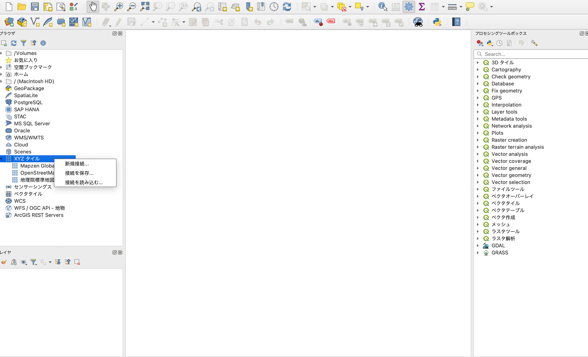 新規接続設定画面が出てくるので、

-   名前に `地理院標準地図`
-   URLに `https://cyberjapandata.gsi.go.jp/xyz/std/{z}/{x}/{y}.png`

を入力し、「OK」を押します。

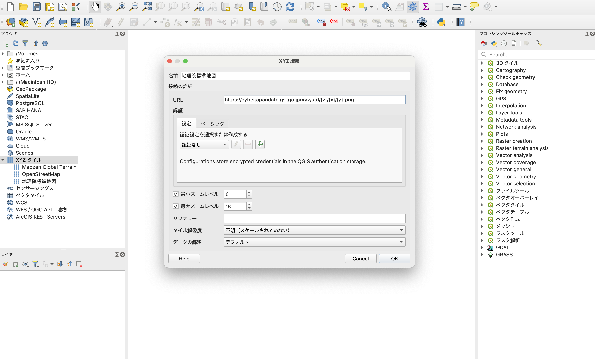 「ブラウザ」の「XYZタイル」に「地理院標準地図」が追加されているので、クリックして地図を表示します。ズームしながらいろいろな場所を見てみましょう！

 \### ベクターデータとラスターデータ 前提として、GISにおけるデータの種類について簡単に紹介します。 GISで用いられるデータは主に**ベクターデータ**と**ラスターデータ**に分類されます。

-   **ベクターデータ**は、市区町村や建物などを**ポイント、ライン、ポリゴン**で表したものです。 それぞれのポイント、ライン、ポリゴンには市区町村名や建物名などの**属性(Attribute)**を紐づけます。ベクターデータはシェープファイル（.shp）やGeoJSON（.geojson）、KML（.kml）といったファイル形式で保存されます。 
-   **ラスターデータ**は一定間隔の格子状にその場所のデータ（標高、土地被覆、色など）が格納されたデータのことを指します。たとえば、航空写真や衛生画像が該当します。この格子の目の大きさを**ピクセルサイズ**ないしは**空間解像度**と呼び、これが細かいほど細部まで詳細に表すことができますが、データサイズが大きくなります。ラスターデータはGeoTIFF（.tiff、.tif）形式で保存されることが多いです。 

[参考：QGIS LAB 「GISデータについて知ろう！ベクタデータとラスタデータの違いを解説」](https://qgis.mierune.co.jp/posts/howto_1_about_data-type)

### 国土地理院数値標高モデル（DEM）を使えるようにする

生態学や自然地理学で使う最も基本的な地理情報に、地形データがあります。 地形データは、5mや1m間隔の格子の中に、その場所の標高が格納されたラスタデータ（数値標高モデル、Digital Elevation Model (DEM)）として表現されます。 日本国内においては、国土地理院がDEMを作成・公開しており、誰でも無償で利用できます。一方、国土地理院DEMはGISでは取り扱いづらいデータ形式で配布されているため、QGISのプラグインを使ってGeoTIFF形式に変換します。

ここでは、[QuickDEM4JPプラグイン](https://github.com/MIERUNE/QuickDEM4JP)を使います。 まず、QGIS上部のメニューバーから「プラグイン」→「プラグインの管理とインストール」をクリックします。  検索窓に`QuickDEM4JP`と入力し、「QuickDEM4JP」を選択してインストールボタンを押します。 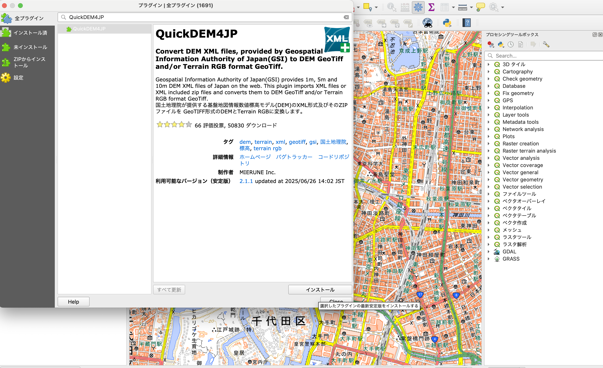 試しに、駿河台キャンパス周辺のDEMをダウンロードして表示してみましょう。 まずは、基盤地図情報ダウンロードサービスのアカウントを作成します。以下のURLからメールアドレスを登録し、本登録まで進んでください。 [ログインページ](https://service-login.gsi.go.jp)

アカウントができたらDEMデータのダウンロードに移りましょう。国土地理院の[基盤地図情報ダウンロードサービス](https://service.gsi.go.jp/kiban/app/)を開き、右上の「ログイン」ボタンから、先ほど作成したアカウントにログインします。

「基本項目・数値標高モデルのダウンロード」から「数値標高モデル」のボタンを押します。 表示された地図をズームして駿河台キャンパスを含むメッシュをクリックします。画面下の「検索結果リスト」タブにデータが追加されるので「ダウンロードリストに全て追加」を押します。「ダウンロードリスト」タブを開き、「ダウンロード等」に進みます。 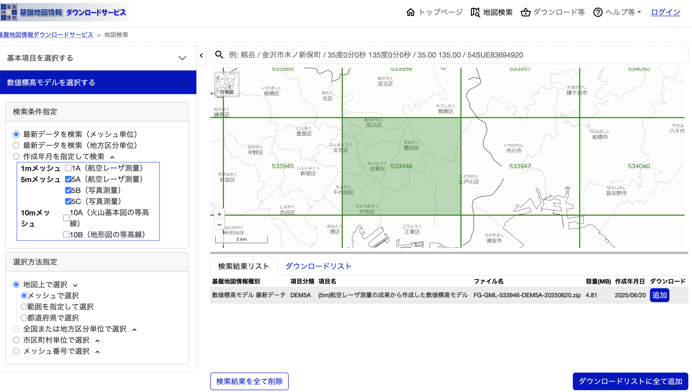

追加したDEMデータを選択し、「ダウンロード」ボタンを押します。登録したメールアドレスにダウンロードリンクが送られてきます。

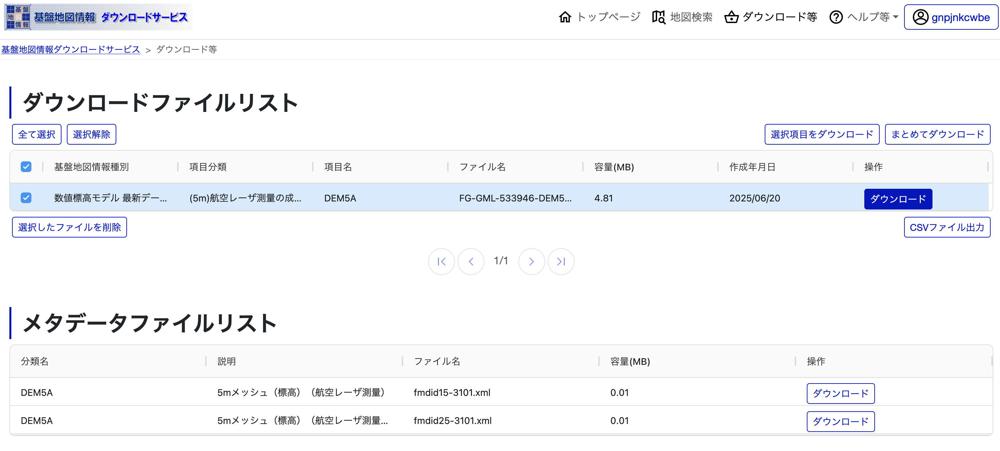 `FG-GML-533946-DEM5A-20250620.zip`というファイルがダウンロードされるので、これを`PG2/3/`以下に移動させます。

画面をQGISに戻しましょう。上部メニューバーの「Processing」から「Toolbox」をクリックして、プロセシングールボックスを開きます。先ほど追加した「QuickDEM4JP」をクリックします。 

「DEM」に、先ほどダウンロードした`PG2/3/FG-GML-533946-DEM5A-20250620.zip`を、「GeoTIFFの出力先」に適当なファイル名（`PG2/3/chiyodaku_dem.tif`）を選択し、「実行」を押します。 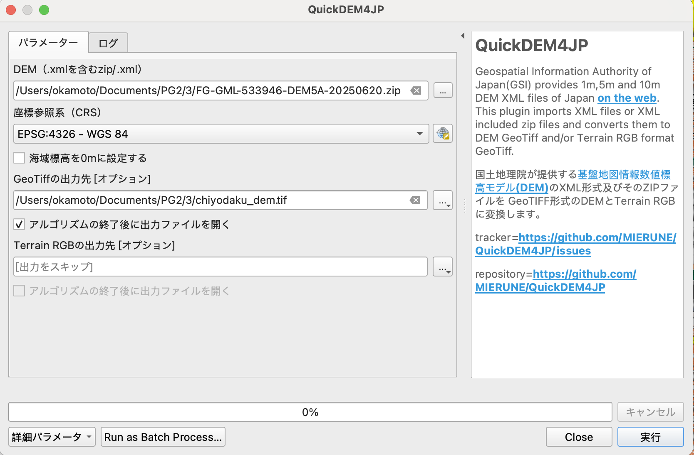

以下のように、標高が格納されたファイルが表示されるはずです！  この図だと白黒でちょっと見辛いので、表示をいじってみましょう。 左下「レイヤ」の`chiyodaku_dem`を右クリックし、「プロパティ」を開きます。 - カラーマップの変更 - 左のタブ一覧から「シンボロジ」タブを開きます。 - 「レンダリングタイプ」を「単バンド擬似カラー」にします。 - 「カラーランプ」を「Viridis」にします。 - 「OK」を押します - 透明度の変更 - 左のタブ一覧から「透明度」タブを開きます。 - 「グローバルな不透明度」を70%にします。 - 「OK」を押します。

 鮮やかなカラーマップが表示されました！半透明で標準地図も見ることができます。 本郷台地から不忍池に伸びる谷地形が印象的ですね！

#### 余裕がある人向けの発展課題

東京23区全域のDEMをダウンロードして一つのGeoTIFFファイルにまとめ、QGIS上で表示してみましょう。 ヒント：「QGIS ラスター 結合」で検索

## RとRStudioのインストール

[R](https://www.r-project.org/)は主に統計解析を目的として作られたプログラミング言語・実行環境で、フリーで使うことができます。世界中のRユーザーが開発したパッケージが無数に公開されており、地理情報解析向けのパッケージも多数あります。

地理情報解析にRを使うメリットはいろいろあります。

-   マウス操作で行うGISソフトと違い、操作をプログラムで記述するため**再現性が担保される**。\
-   統計解析や機械学習、論文に使える綺麗な図の作成まで一貫して行える.
-   解析結果をいちいち表示しないので**GISソフトより計算が速い**.
-   フリーソフトなので、所属機関が変わっても使える.
-   構文が簡単でプログラミングの初歩的な学習に向いている…….

[RStudio](https://posit.co/download/rstudio-desktop/)は（主に）R言語のプログラミング・実行を行うための統合開発環境（IDE、プログラムを書くエディタと実行環境がセットになったもの）です。必須ではありませんが、RStudioを使うとより効率的にRプログラミングができます。

インストールは[このインストラクション](https://best-biostatistics.com/r/rstudio_start.html)に従いましょう。

### Rパッケージのインストール

最後に、地理情報解析に用いるRパッケージをインストールします。 後の章では他のパッケージも追加しますが、ここではとりあえず以下をインストールします。

-   `tidyverse`：データ処理とグラフ作成に使うパッケージ群
-   `sf`：ベクターデータ処理用のパッケージ
-   `terra`：ラスターデータ処理用のパッケージ
-   `tidyterra`：`terra`を用いたラスター演算を行いやすくするためのパッケージ
-   `lwgeom`: `sf`の機能を補完するパッケージ
-   `leaflet`: インタラクティブな地図を表示するためのパッケージ

### Windows

RStudioの`Console`ペイン（左下）に

```         
install.packages(c("tidyverse", "sf", "terra", "tidyterra", "lwgeom", "leaflet"))
```

と入力し、エンターを押します。

### Mac

Macではいくつか依存するパッケージを事前にインストールする必要があります。 ここでは、[homebrew](https://brew.sh/ja/)というパッケージマネージャを使ってインストールしましょう。 まず、「ターミナル」アプリを開き、以下を実行します。

```         
/bin/bash -c "$(curl -fsSL https://raw.githubusercontent.com/Homebrew/install/HEAD/install.sh)"
```

これで`brew`コマンドが使えるようになりました。 続いて、必要なパッケージをインストールします。 以下をターミナルで実行します。

```         
brew install harfbuzz fribidi libpng libtiff
brew install pkg-config gdal
```

画面をRStudioに切り替え、コンソールペインに以下を貼り付けて実行します。

```         
install.packages("sf", type = "source", configure.args = "--with-proj-lib=$(brew --prefix)/lib/")
install.packages(c("tidyverse", "terra", "tidyterra", "lwgeom", "leaflet"))
```

エラーが出たら教えてください！

### 日本語文字化け問題の解決

このままだと、グラフを作成した際に日本語が文字化けすることがあります。 `Tools → Global Options → General → Graphics`から、`Graphic Device → Backend`を`AGG`に設定しましょう。

## RStudioの使い方

まず簡単に、RStudioの使い方を見てみましょう。 RStudioの画面は以下のように4分割されています（右半分は起動時は隠れていることがあります）。分割された領域のことを、「ペイン」と呼びます。左上が`編集画面`で、`新規作成`ボタンで作成したRスクリプトをここで編集します。左下は`コンソール`で、Rスクリプトを実行するための場所です。右側には、R上にある変数（次回説明します）の一覧や、Rが作成した図を表示するためのペインがあります。

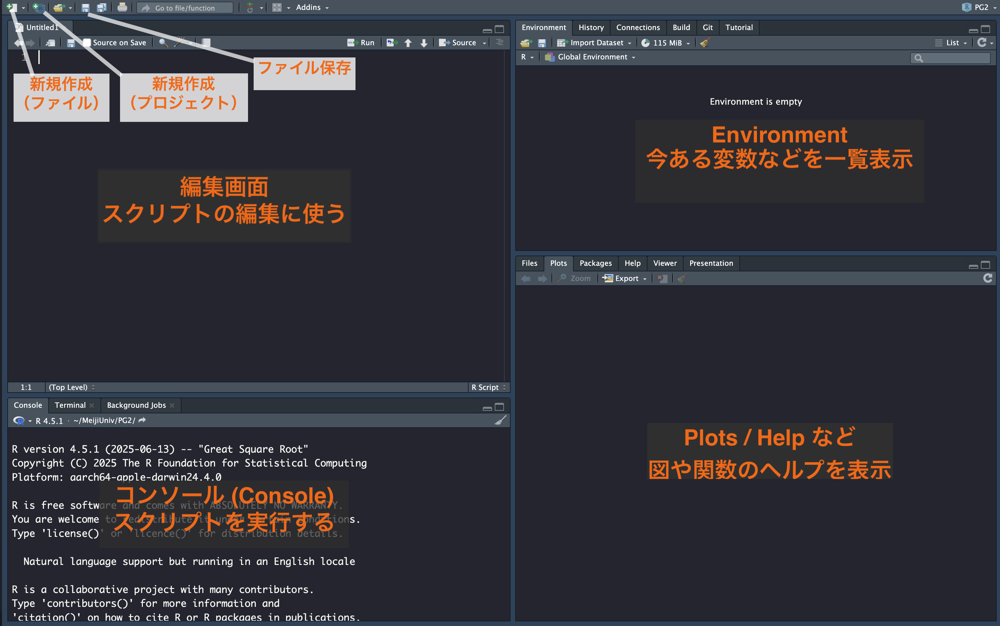

それでは、先ほどダウンロードしたDEMを表示するRスクリプトを書いてみましょう。

### ステップ①　プロジェクトの作成

RStudioにはプロジェクトという機能があり、これを使うとファイル管理が簡単になります。 プロジェクトの作成は、左上のプロジェクト新規作成（`Create a Project`）ボタンで行います。このボタンを押すと、新しくフォルダを作るか、既存のフォルダを使うか選ぶ画面が出てきます。

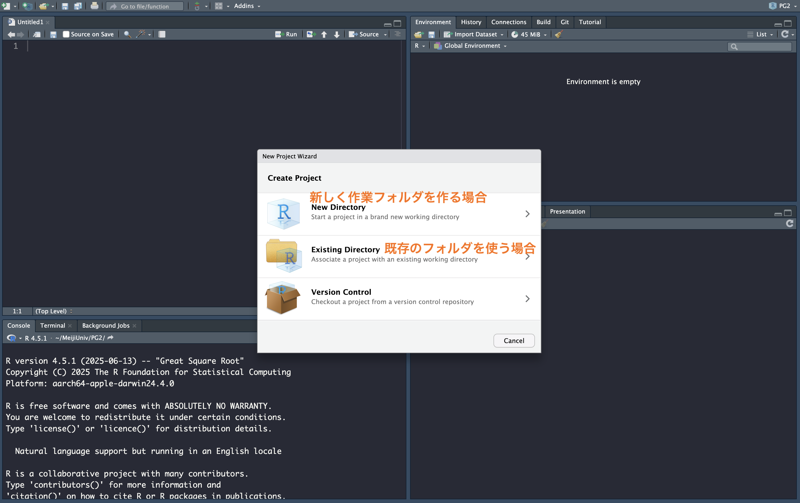

今回は、先ほどTIFファイルを作成したフォルダ（`PG2/3`）で作業したいので、`Existing Directory`を選びます（「フォルダ」と「ディレクトリ」は同じ意味です）。

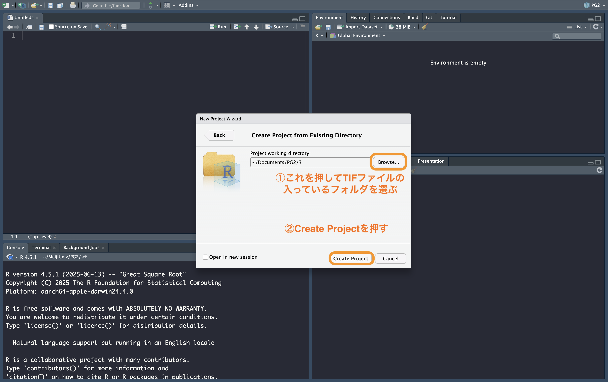

`Browse`を押してTIFファイルの入っているフォルダ(`PG2/3`)を選び、`Open`を押します。次に、`Create Project`を押します。

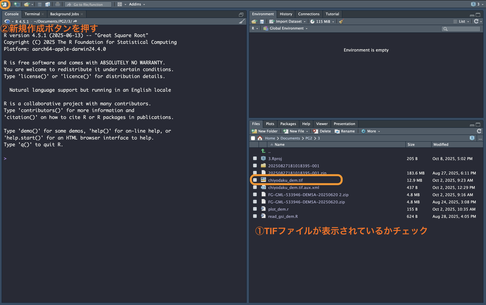

画面が切り替わり、右下のペインの`Files`タブに`PG2/3`以下のファイルが表示されるようになります。

### ステップ②　Rスクリプトの作成

それではRスクリプトの作成に移りましょう。 RStudioの左上の白紙にプラスアイコンのボタン（New File）を押して、「R script」を選びます。（左）上のペインに編集画面が出てくるので、以下をコピーします。

```{r}
#| include: true
#| message: false
#| collapse: true
#| eval: false

setwd("~/Documents/PG2/3") #| hide_line
library(terra)
library(tidyterra)
library(tidyverse)
dem <- rast("chiyodaku_dem.tif")
ggplot() +
  geom_spatraster(data = dem)
```

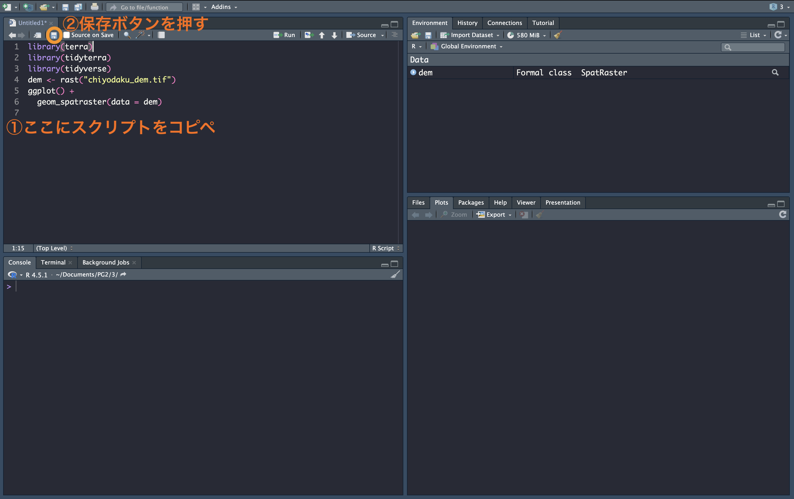

コピペしたら左上の保存ボタンを押し、`plot_dem` と言う名前をつけて保存しましょう。

### ステップ③　Rスクリプトの実行

それでは作成したRスクリプトを実行してみましょう！

**Rスクリプトは上から順に実行します**。 スクリプトの編集画面で実行したい行をクリックしてから編集画面の上部にある`Run`ボタンを押すと、その行が実行され、カーソルが自動的に次の行に移動します。 実行結果はコンソールに表示されます。

動画のように、`Run`ボタンを連打すると、上から順にスクリプトが実行され、DEMデータが図として表示されるはずです。



長いスクリプトを実行する際には、下の動画のように、ドラッグでスクリプト全体を指定してから`Run`を押すことも可能です。



ここでやっていることは、編集画面に書かれたRスクリプトをコンソールにコピペしているのと同義です。 したがって、下の動画のように、スクリプトを全部コンソールに手作業で打ち込むこともできます（面倒ですが）。 プログラムを書く最中にコンソールに直接スクリプトを打ち込むことも意外とあるので覚えておきましょう。



## 第二回の課題

第二回も下準備なので特段課題はありません。今回のセットアップでつまづいた点などがあれば、Oh-meijiの「第二回授業/第二回振り返りコメント」から回答してください。ない場合も「なし」と回答お願いします。