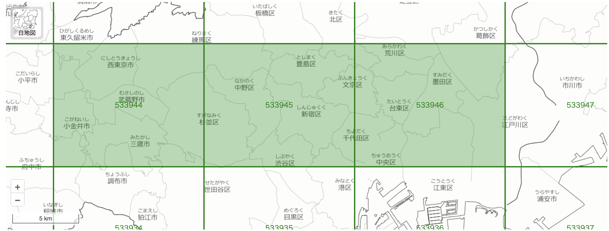
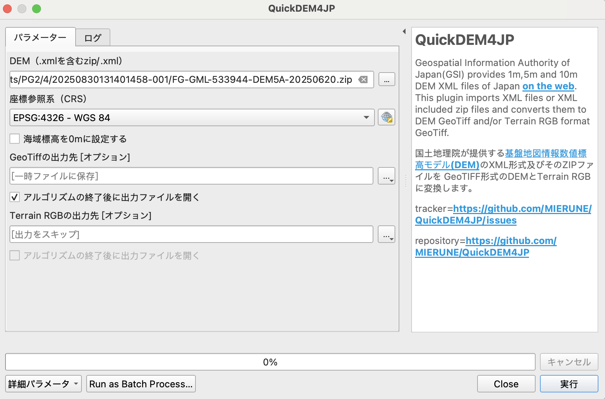
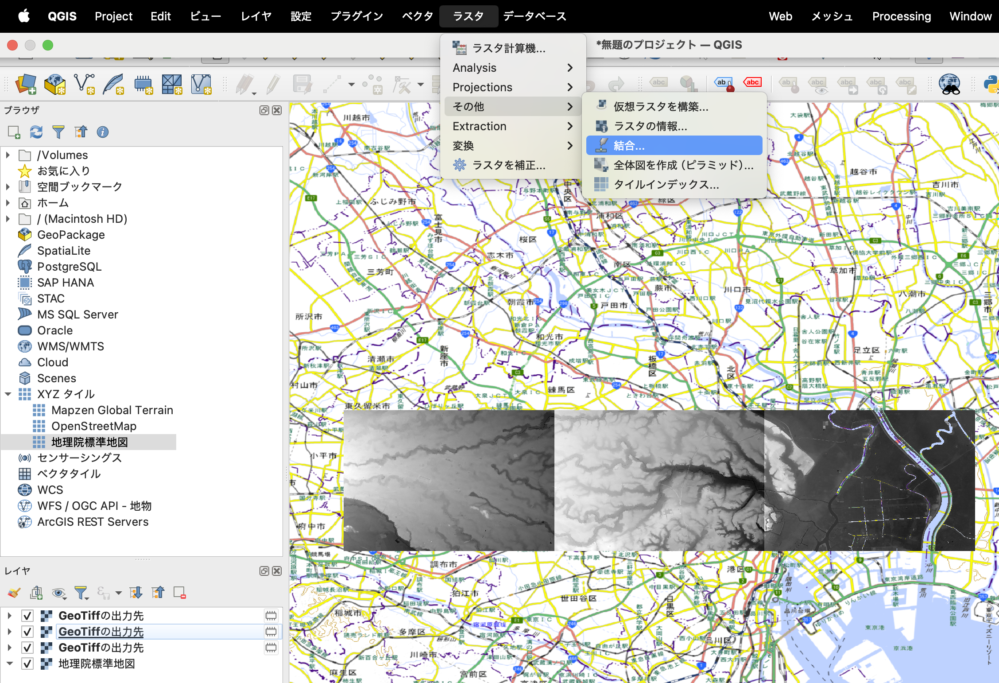
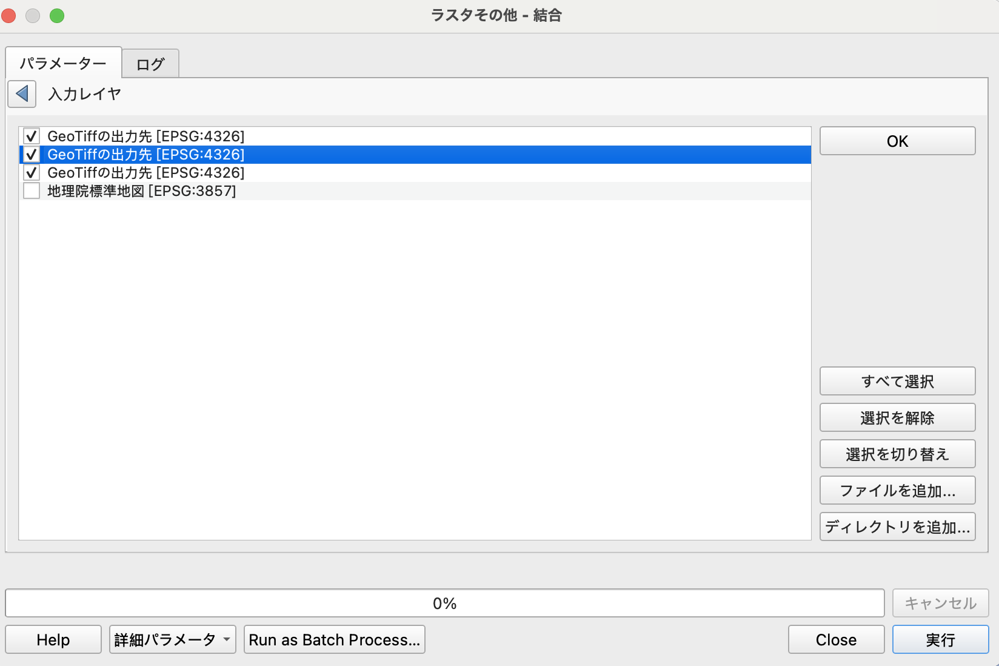
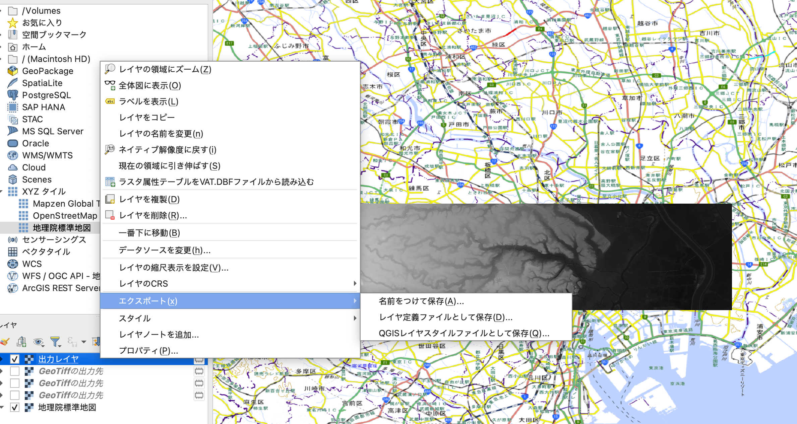
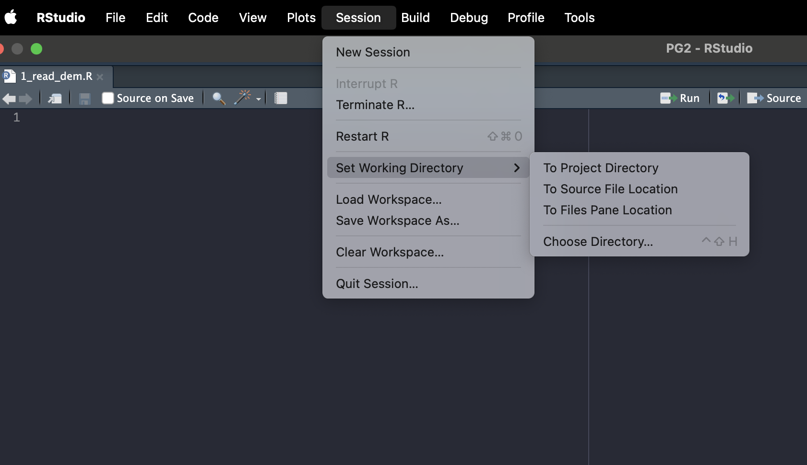
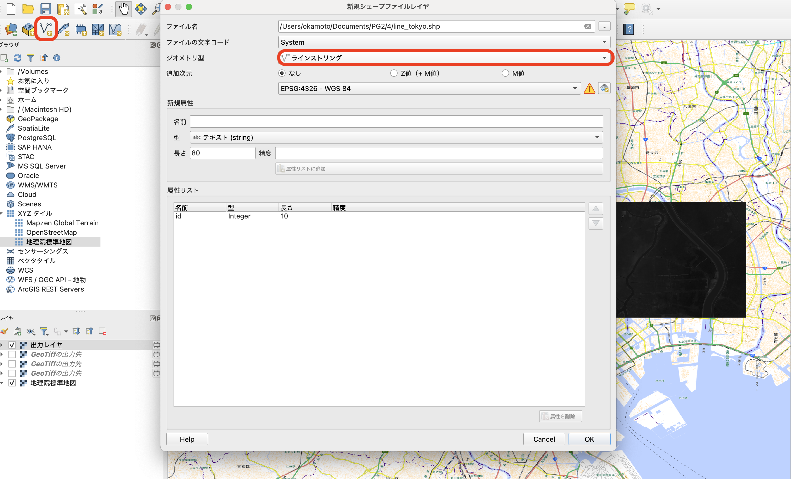

# RStudioを用いた地理情報解析の基礎

ここでは、二回にわたってRを用いた地理情報解析を実践してゆきます。 まずは、解析用のフォルダを前回作成した`PG2/`以下に`PG2/4/`として作成しましょう。

## （本当に雑な）Rの基礎

ここでは、本書でよく使うRの基本的な文法やデータ操作について触れます。Rの基礎をしっかりと学ぶ時間はないので、ざっくり本書で取り扱うサンプルコードの意図が汲み取れる状態を目指して、よく使う構文を攫っていきましょう。きちんと基礎から学びたい人には、[卒業論文のためのR](https://tomoecon.github.io/R_for_graduate_thesis/)をお勧めします。

それではRStudioを開いて、`Console`と書かれた左下のペインにサンプルコードをコピペしながらRの使い方を学んでいきましょう！

### 演算

#### 簡単な演算

まずは簡単な四則演算を行ってみましょう。 Rはじめ、多くのプログラミング言語では全角文字は使えません。 実行時に無視される「コメント」以外では使わないようにしましょう。 以下では、プログラムの実行結果を`##`で表現します。

```{r}
#| include: true
#| message: false
#| collapse: true

# 半角シャープ以降は「コメント」です。Rの実行時には無視されます。
1 + 1 # 足し算
2 - 1 # 引き算
3 * 4 # 掛け算はアスタリスク
8 / 2 # 割り算
```

#### 変数

次に、「変数」を使ってみます。変数を使うと、計算結果などの任意の値に名前をつけることができます。変数に値を代入する際には、`<-`を使います。

```{r}
#| include: true
#| message: false
#| collapse: true

a <- 1 + 2
a
b <- 3 * 4
b
c <- a + b
c
```

#### 関数

`-`や`+`以外の、もっと複雑な操作には「関数」を使います。 「関数」は、受け取った値に対して所定の処理を行い返す手続きのことです。 例えば`sum()`関数では、`()`の中に受け取った値を足し合わせて返します。

```{r}
#| include: true
#| error: true
#| collapse: true
sum(1,2,3,4) # 足し合わせる
mean(1,2,3,4) # 平均

max(1,2,3,4) # 最大値
min(1,2,3,4) # 最小値

range <- max(1,2,3,4) - min(1,2,3,4) # 値の幅
range
```

関数は星の数ほどあるので、使い方を覚えるのは無理です。わからなくなった際には、`Console`に`?関数名`（例：`?sum`）と打つと、右下の`Help`ペインに使い方が表示されます。

#### ベクトル

最後の例では、`min()`と`max()`の両方に、`1,2,3,4`という同じ値の組み合わせを入れていました。`1,2,3,4`をまとめて一つの変数に代入できれば便利そうですね。そういった時には、「ベクトル」を使います。ベクトルは同じ種類の値を複数個まとめたもので、`c()`関数で作ります。

```{r}
#| include: true
#| error: true
#| collapse: true
a <- c(1,2,3,4)
a
sum(a)
range <- max(a) - min(a)
range
```

### 型

上記では数字だけを取り扱ってきましたが、Rは数字以外のデータを扱うこともできます。 プログラミング言語では、データの種類のことを「型」と呼びます。 例えば、数字の1と文字としての"1"は全く別のものとして取り扱われます。 したがって、以下の例では文字である"1"を足し算で用いることができないため、エラーが生じます。

```{r}
#| include: true
#| error: true
#| collapse: true
1 + "1"
```

それでは、Rで用いられる（主な）型をみていきましょう。

#### 数値 (numeric)

```{r}
#| include: true
#| message: false
#| collapse: true

1 / 3
```

#### 文字列 (character)

```{r}
#| include: true
#| message: false
#| collapse: true

"a"
paste("Hello", " ", "R") # paste()で文字列を結合します。半角スペースも立派な文字です。
```

#### 論理 (logical)

```{r}
#| include: true
#| message: false
#| collapse: true

a <- 2 + 3
a == 5 # 「同じか」は ==
a != 5 # 「違うか」は !=
a < 4
a > 2
```

#### 欠損値など (NA, Inf)

```{r}
#| include: true
#| message: false
#| collapse: true

NA # 欠損値（あるはずの値がないもの、Not Available）

1/0 # 無限大はInfになる

a <- NA
is.na(a) # is.na()で欠損値か確認できる
```

### Rの基本はデータフレーム

ここからは、もう少し実践的な内容に移っていきます。 少しプログラムが長くなるので、コンソールに直接コピペするのではなく、ファイルにスクリプトを書き込んで保存し、実行するようにします。

まず、RStudioの左上にある「白紙に緑のプラス（New File）」のボタンを押し、「R Script」を選択します。左上のペインに新しいファイルが表示されたはずです。ここにスクリプトを書き込んで行きます。

「Ctrl + S」を押すとファイルを保存することができます。保存先には、`PG2/4/`を選び、適宜適当な名前をつけましょう。繰り返しになりますが、ファイル名には全角文字は使わないようにします。

それでは内容に入っていきます。少し極端な言い方ですが、Rで取り扱うデータはほとんど「データフレーム」です。 データフレームとは、雑に言えばExcelで作られるような表形式のデータのことです。 例を挙げましょう。

```{r}
#| include: true
#| message: false
#| collapse: true

# Rにデフォルトで入っているpenguinsデータを使う
head(penguins, 10) # 長いので10行目まで表示
```

`penguins`はRにサンプルデータとして含まれているデータセットで、文字通りペンギンの種類や体重などに関するデータが含まれています。上記のように、データフレームでは縦方向（列）に同じ種類、横方向（行）に同じ観測（この場合は個体）が来るようにデータが配置されます。

それでは、このデータで少し遊んでみましょう。

### `mutate()`で新しい列を作る

以降では、`tidyverse`というパッケージ（群）を使います。`tidyverse`はデータフレームの処理やビジュアライゼーションを簡単に行うためのパッケージです。 パッケージの読み込みは`library()`で行います。

まずは、既存の列の値を使って新しい列を作る`mutate()`関数を使ってみます。 ここでは、`|>`という記号で処理を繋いでいますね。これは「パイプ」と呼ばれるもので、その名の通り複数の処理を繋ぐためのものです。

```{r}
#| include: true
#| message: false
#| collapse: true

library(tidyverse)

df <- penguins |>
  mutate(
    bill_size = bill_len * bill_dep, # 嘴の長さと高さを掛けて大きさにする
    bill_aspect = bill_len / bill_dep # 嘴の縦横比
  ) |>
  mutate(
    relative_bill_size = bill_size / body_mass # 体重に比した嘴の大きさ
  )

head(df, 10) # 10行目まで表示
```

以上では、`bill_size`、`bill_aspect`, `relatibe_bill_size`という３つの列を作ってみました。

### `filter()`で行を絞り込む

次に、特定の列の値を使って行を絞り込みます。例えば、メス個体のデータだけ集めてみましょう。 `filter()`には絞り込みたい条件式（論理型を返す）を書きます。

```{r}
#| include: true
#| message: false
#| collapse: true

df |>
  filter(sex == "female") |>
  head(10) # はじめの10行を表示
```

### `select()`で列を選ぶ

最後に、欲しい列だけ選ぶ`select()`を使ってみます。`select()`ではかなり柔軟に列を選ぶことができます。

```{r}
#| include: true
#| message: false
#| collapse: true

# 列名で選択
df |>
  select(species, body_mass, year) |>
  head(10)

# "bill" で始まる列を選択
df |>
  select(starts_with("bill")) |>
  head(10)
  
# "len"で終わる列を選択
df |>
  select(ends_with("len")) |>
  head(10)
```

### `ggplot()`で図を作る

お疲れ様です（書いてる僕も疲れました）。最後のステップ、いよいよデータを図にしてみましょう。図の作成には`ggplot()`を使います。基本的な使い方としては、

```{r}
#| eval: false

ggplot(aes(x = X軸に使う列名, y = Y軸に使う列名, ...)) + # どの列をどの軸に使うか
  geom_グラフの種類() # グラフの種類を指定（例：geom_box()で箱ひげ図、geom_point()で散布図）
```

のように書きます。`ggplot()`以降はパイプではなく`+`で処理を繋いでいきます（なぜ？僕に分かりません...）。他にも使う色のセットや文字の大きさなど、細かい設定を順次`+`で足していけるので、論文でそのまま使える綺麗な図を作成することができます。設定できる項目が膨大なのでちょっととっつきづらいですが、ググれば参考になる情報は多いので心配ありません。

```{r}
#| include: true
#| message: false

# まず簡単な例。bill_lenとbody_massの関係をみてみます
df |> # ここはパイプ
  drop_na() |> # NAを含む行を削除
  ggplot(aes(x = body_mass, y = bill_len, color = species)) + # aes()でどの列をx軸、y軸、色に割り当てるかを指定
  geom_point()
  
# 次に、種ごと、島ごと、性別ごとの体重をプロットしてみる
df |>
  drop_na() |>
  ggplot(aes(x = island, y = body_mass, fill = sex)) + # 輪郭や点の色はcolour、塗りつぶしの色はfillで指定
  geom_violin() + # バイオリンプロット。見慣れないかもしれないけど、箱ひげ図の進化形です。
  facet_wrap(~species) # 種ごとに図を分ける

# 最後に、さっき作った列を使ってみる
df |>
  drop_na() |>
  ggplot(aes(x = relative_bill_size, y = bill_aspect, colour = sex)) +
  geom_point() +
  facet_wrap(~species)
```

### 進む前に

さて、ここまできてプチ絶望している人も多いと想像しますが、次に行く前に @sec-kotsu を読んでみてください。 プログラミングで大事なのは、**悩まず手を動かす（試す、ググる、ChatGPTに聞く）こと、気楽に取り組むこと**、です。

### 時間が余ったら

逆に、余裕すぎて授業中ヒマな人もいるかもしれません。そんなあなたは、[R for Datascience の Data Visualization の章](https://r4ds.hadley.nz/data-visualize.html)を読んで、サンプルコードを動かしてみましょう。練習問題（Exercise）が時々出てくるので、それも解いてみてください。終わったら別の章に進んでいいです。英語が苦手な人は、ChatGPTなどに訳してもらうといいと思います。これは本当にいい教科書です！`tidyverse`生みの親であるHadley Wickham氏が中心となって書いており、データを扱う際の心得的なことから実際のテクニックまで網羅されています。

## 第三回の課題

`penguins`のデータを使って、新しいグラフを書いてみましょう。`mutate()`、`filter()`の少なくともどちらかを使ってください。

Wordなどに、

-   出来上がったグラフ

-   グラフ作成のためのRscript

-   グラフの意味するところ

をまとめて、**PDFで**Oh-meijiのレポート欄（第三回授業/第三回小レポート）から提出してください。

## 実践： DEMデータで遊ぶ

それでは地理情報解析に取り組んでみましょう。今回のテーマは、前章で軽く扱った国土地理院の数値標高モデル（DEM）データを用いて実践的な解析を行うことです。

### データの準備

もう少し広い範囲のDEMデータを準備して、Rを駆使しながら遊んでみましょう。 まずは、前回と同様に[基盤地図情報ダウンロードサービス](https://service.gsi.go.jp/kiban/app/)からDEMデータをダウンロードします。墨田区から武蔵野市にかけて、東西方向に3つのタイルを選択します。



「ダウンロードリストに全て追加」→「ダウンロード等へ」→「まとめてダウンロード」を選択し、メールで送られてきたリンクからダウンロードします。 今回は、`2025xxxxxxxxxxxx-001.zip`のようなZIPファイルがダウンロードされているので、これを`PG2/4/`に移動し、解凍します。

```         
4
└── 20250830131401458-001
    ├── FG-GML-533944-DEM5A-20250620.zip
    ├── FG-GML-533945-DEM5A-20250620.zip
    ├── FG-GML-533946-DEM5A-20250620.zip
    ├── fmdid15-3101.xml
    └── fmdid25-3101.xml
```

このような形で、`.zip`ファイルが3つあるはずです。 それでは、これをそれぞれQGISでGeoTIFFファイルに変換しましょう。 今回は、`GeoTIFFの出力先`を`[一時ファイル保存]`にします。 

以下のような感じで、3つのDEMファイルが読み込まれました。



次に、これらを一つに結合します。`ラスタ→その他→結合`を選び、`入力レイヤ`に先ほど作成された3つのレイヤ（`GeoTIFFの出力先`という名前のはず）を選択し、`実行`を押します。



結合されたレイヤが作成されるので、これをGeoTIFFファイルとして保存します。 `出力レイヤ`を右クリックし、`エクスポート→名前をつけて保存`を選びます。`ファイル名`を編集して、`PG2/4/`に`dem_tokyo`という名前で保存しましょう。



ファイルエクスプローラを使って、`PG2/4/dem_tokyo.tif`が存在することを確かめます。

### まずはRで読み込んでみる

それでは、RStudioに画面を切り替えます。 RStudioの左上にある新規作成ボタン（白紙に緑のプラスマーク）を押し、`R Script`を選択します。`Ctrl + S`（Macの場合は`Cmd + S`）を押すと、保存先のファイル名を聞かれるので、`PG2/4/1_read_dem.R`として保存します。

次に、Rを実行する場所を指定します。`Session → Set Working Directory → To Source File Location`を選んで、RStudioに作業場所が`PG2/4/`であることを教えます。



それでは、以下をコピペして`Source`と書かれたボタンを押します。右下のペインにDEMが表示されるはずです。

```{R}
#| include: true
#| message: false
#| collapse: true
#| results: hold
# 1_read_dem.R
setwd("~/Documents/PG2/4/") # 人によって違うかもしれません
library(terra)
library(tidyverse)
library(tidyterra)
dem <- rast('dem_tokyo.tif')
dem
# Rで図を書く際には、ggplotライブラリを使います。
ggplot() + # まずggplotを初期化し、+で要素を足していきます。
  geom_spatraster(data = dem) # 次にgeom_spatraster()という種類の図を追加します。
```

### 市区ごとの標高をグラフにする

次に、ベクターデータと組み合わせて解析してみましょう。 満遍なく均一にデータが敷き詰められたラスターデータを、ベクターデータで特定のエリアごとに分割して集計する作業を行います。

まずは簡単な例として、DEMデータを市区ごとに分割し、市区ごとの標高分布をグラフにしてみます。

`dem_tokyo.tif`には武蔵野市、杉並区、中野区、新宿区、文京区、千代田区、台東区、墨田区が（おおむね）含まれているので、これらの市区間で比較しましょう。

書き始める前に、日本の自治体の地理情報をまとめたRパッケージ`jpndistrict`をインストールします。 `Console`ペインに以下を貼り付けて実行します。

```         
install.packages("remotes")
remotes::install_github("uribo/jpndistrict")
```

それでは、解析用のRスクリプトを`PG2/4/2_dem_cities.R`として作成します。

```{R}
#| include: true
#| message: false
#| collapse: true
# 2_dem_cities.R

library(terra)
library(tidyverse)
library(tidyterra)
library(jpndistrict)

setwd("~/Documents/PG2/4/")

dem <- rast('dem_tokyo.tif')

# 欲しい市区の名称
city_names <- c("武蔵野市", "杉並区", "中野区", "新宿区", 
            "文京区", "千代田区", "台東区", "墨田区")

# 都道府県のJISコードを確認する
# 東京は13
jpnprefs |> print(n = 20)

cities <- jpn_cities(jis_code = 13, admin_name = city_names)

# geometry列に市区のポリゴンデータが入っている
cities

# DEMデータに合わせるように、市区データをラスタライズする
cities_raster <- cities |>
  rasterize(dem, field = "city")

# DEMデータのセルに市区名が入ったデータが出来上がる
ggplot() + 
  geom_spatraster(data = cities_raster)

# DEMデータと市区名ラスターを結合し、データフレームに変える
dem_city <- c(dem, cities_raster) |>
  as_tibble() |> # データフレームに変換
  mutate(city = factor(city, levels = city_names)) |> # 表示順をcity_namesの順番にする
  drop_na()

dem_city 

# geom_histgram()でヒストグラムを作成
# x軸は標高にしたいので、dem_tokyoを指定
# facet_wrap()でcity別にヒストグラムを作る
# labs()で軸のラベルを変える
dem_city |>
  ggplot() +
  geom_histogram(mapping = aes(x = dem_tokyo)) +
  facet_wrap(~city) +
  labs(x = "DEMデータの標高（m）", y = "頻度")
```

### 地形の断面を見てみる {#sec-dammen}

次に、地図上に線を引いて地形の断面を見てみましょう。 まずは断面の元になる線をQGISで引きます。



`新規シェイプファイルレイヤ`をクリックし、`ジオメトリ型`には`ラインストリング`を指定、`PG2/4/line_tokyo.shp`として保存します。


`編集モードを切り替え`、`線の地物を追加`を押してから地図上に適当な線を引きます。ダブルクリックすると線の描画を終了できます。最後に`レイヤ編集内容を保存`を押して保存しましょう。

これをRで読み込みます。 新しく、`PG2/4/3_cross_section.R`を作成しましょう。

```{R}
#| include: true
#| message: false
#| collapse: true
# 3_cross_section.R

library(terra)
library(tidyverse)
library(tidyterra)
library(jpndistrict)
library(sf)

setwd("~/Documents/PG2/4/")

# DEMを読み込む
dem <- rast("dem_tokyo.tif")
# 線を読み込む
section <- st_read("line_tokyo.shp")

# 市区のデータをDEMに合わせてラスターにする
city_names <- c("武蔵野市", "杉並区", "中野区", "新宿区", 
                "文京区", "千代田区", "台東区", "墨田区")
cities_raster <- jpn_cities(jis_code = 13, admin_name = city_names) |>
  rasterize(dem, field = "city")

# とりあえずプロット
ggplot() +
  geom_spatraster(data = dem) +
  geom_sf(data = section, colour = "white")

# 線に沿って標高と市区名を取得
# x（経度）,y（緯度）, 値の入ったデータフレームが返ってくる 
elevation <- extractAlong(dem, section, xy = TRUE, ID = FALSE)
cities <- extractAlong(cities_raster, section, xy = TRUE, ID= FALSE)

# 両者を結合し、横軸を経度、縦軸を標高、色を市区名にした折れ線グラフを描く
elevation |>
  mutate(city = factor(cities$city, levels = city_names)) |> # 新しい列としてcityを追加
  drop_na() |>
  ggplot(aes(x = x, y = dem_tokyo, colour = city)) +
  geom_line() +
  labs(x = "経度", y = "標高", colour = "市区名")
```

### 河川の標高と傾斜をグラフにする

最後に、河川に沿って同様の図を描いてみましょう。折よくこのエリアには神田川が流れているので、神田川に沿って、標高の変化をグラフにします。今回は追加で、DEMから傾斜角も算出してみます。

まずは、河川のデータを取得します。 [国土数値情報ダウンロードサイト](https://nlftp.mlit.go.jp/ksj/gml/datalist/KsjTmplt-W05.html#!)から河川データがダウンロードできます。データの選択で東京都を選び、ダウンロードしてください。

`W05_08_13_GML.zip`がダウンロードされたと思うので、これを`PG2/4/`に移動して解凍します。中には`Stream.shp`と、`RiverNode.shp`の二つが入っていますが、今回は前者を使います。

それではRスクリプトを書いていきましょう。 今回のファイル名は`PG2/4/4_stream.R`にします。

```{R}
#| include: true
#| message: false
#| collapse: true
# 4_stream.R
library(terra)
library(tidyverse)
library(tidyterra)
library(jpndistrict)
library(sf)

setwd("~/Documents/PG2/4/")

dem <- rast("dem_tokyo.tif")
stream <- st_read("W05-08_13_GML/W05-08_13-g_Stream.shp")
stream

# W05_004には河川名称が入っているので、これが神田川の行だけ選ぶ
# 距離の計算に使いやすいように、st_transform()でCRSをUTM(54)に変換
kandagawa <- stream |>
  filter(W05_004 == "神田川") |>
  st_set_crs(4326) |>
  st_union() |> # 河川流路が複数のラインに分割されているので、結合
  st_transform(6691)

kandagawa

# 1mあたり0.01個の密度（=100 m間隔）で神田川に沿って点をサンプリング
kandagawa_points <- st_line_sample(kandagawa, density = 0.01) |>
  st_cast("POINT") |>
  st_as_sf() |>
  arrange(desc(row_number())) |> # 順序を反転させ
  mutate(distance = (row_number() * 100)) # 河口からの距離を計算

# 欲しい市区の名前をDEMの各セルに紐付け
city_names <- c("武蔵野市", "杉並区", "中野区", "新宿区", 
                "文京区", "千代田区", "台東区", "墨田区")
cities_raster <- jpn_cities(jis_code = 13, admin_name = city_names) |>
  rasterize(dem, field = "city")

# 重ねてみる
ggplot() +
  geom_spatraster(data = dem) +
  geom_sf(data = kandagawa_points, aes(colour = distance)) +
  scale_color_viridis_c() + # 河口からの距離はカラーマップを変える
  labs(colour = "河口からの距離 (m)", fill = "標高")

# 神田川沿いにサンプリングした100m間隔の点の標高を取得
elevation <- terra::extract(dem, kandagawa_points, bind = TRUE, exact = TRUE) |>
  st_as_sf()
# 同様に、点の市区名を取得。
cities <- terra::extract(cities_raster, kandagawa_points, bind = TRUE) |>
  st_as_sf()

# 河口からの距離と標高をプロットしてみる。
elevation |> 
  mutate(city = cities$city) |>
  ggplot(aes(x = distance, y = dem_tokyo, colour = city)) +
  geom_point() +
  scale_x_reverse() + # X軸は降順にする
  labs(x = "河口からの距離 (m)", y = "標高", colour = "市区")
```

あれ、川は坂を登ることはないはずですが、文京区と新宿区のあたりで妙な挙動を示していますね。神田川を地図にプロットして何が起きてるかみてみましょう。 以下を書き加えます。

```{R}
#| include: true
#| message: false
#| collapse: true
# 4_stream.R（続き）

library(leaflet)
elevation |>
  mutate(city = cities$city) |>
  st_transform(4326) |> # Leafletで表示するために緯度経度に直す
  filter(city %in% c("新宿区", "文京区")) |> # 新宿区or文京区で
  filter(dem_tokyo > 2.5 & dem_tokyo < 5) |>  # 標高が2.5 ~ 5 m
  filter(distance < 6000) |>                  # 河口からの距離が6km以内の場所に絞る
  leaflet() |>
  addTiles() |>  # Add default OpenStreetMap map tiles
  addMarkers()
```

首都高でした！ここですね。


### Coordinate Reference System (CRS)

先ほどのスクリプトでしれっと重要な概念が出てきたので解説します。

```{r}
#| include: true
#| message: false
#| collapse: true
#| evaluate: false
# W05_004には河川名称が入っているので、これが神田川の行だけ選ぶ
# 距離の計算に使いやすいように、st_transform()でCRSをUTM(54)に変換
kandagawa <- stream |>
  filter(W05_004 == "神田川") |>
  st_set_crs(4326) |>
  st_union() |> # 河川流路が複数のラインに分割されているので、結合
  st_transform(6691)
```

この部分ですね。`4326`や`6691`は何を示す数字でしょうか？これは座標参照系(Coordinate Reference System, CRS)と呼ばれるもので、ある場所の地理座標を表すための体系のことです。地理座標というと、一般的には緯度経度をイメージすると思いますが、地球は楕円体なので緯度経度の差分は距離を正しく表しません。したがって、距離や面積などの幾何的な計算を行う上で、緯度経度を使うのは不便です。そこで、ユニバーサル横メルカトル座標系（Universal Transverse Mercator, UTM座標系）や平面直角座標系といった座標系が用いられています。これらの座標系では、地球の表面を多数のエリアに分割し、そのエリアを平面に投影することで幾何的な計算が容易な座標（m単位）で場所を表現します。

座標系の表記にはいくつかの方法がありますが、最もシンプルなのは[EPSGコード](https://lemulus.me/column/epsg-list-gis)による指定です。これは4\~5桁の数字でぞれぞれの座標系を識別するもので、最も一般的なWGS84（GPSで使われている座標系）のEPSGコードは`4326`です。

座標系は奥が深く、実際には複雑な形状を持つ地球をどのような形で近似するか、どこを原点とするかといった要素によって無数にあります。この授業の範疇を超えるので詳細は省略しますが、興味のある方は調べてみてください。

さて、GSIの実践で重要になってくるのは、データによって配布されている座標系が異なっていたり、解析によっては座標系を特定のものにする必要がある、ということです。上記の例を紐解いてみましょう。

まず、`st_set_crs(4326)`では、河川データのCRSがWGS84であることを明示的に指定しています。次に、`st_transform(6691)`でUTM座標系に変換することで、距離計算が容易にできるようにしているわけです。

### 余裕がある人へ

1.  斜めに引いた線上の断面図の作成\
    @sec-dammen では経度線に沿って断面を作成しました。したがって、断面図を書く際には、X軸には経度を指定するだけで良かったわけです。そこで今度は、斜めに線を引いた際の断面図を作ることを考えてみましょう。神田川の傾斜図を描いた際のことを参考にすれば、方法がわかるはずです。線はどのように引いても構わないので、QGIS上で適当に引いてみてください。
2.  @sec-dammen の最後では、標高が怪しい場所をインタラクティブな（拡大縮小などの操作が可能な）地図上に表示しました。これは、[`leaflet`](https://rstudio.github.io/leaflet/)というライブラリを使って作ったものです。`leaflet`の使い方を調べて、先ほど使った市区エリアのデータや標高データをインタラクティブな地図上に表示するプログラムを作ってみましょう。余裕があれば、背景地図をデフォルトのOpenStreetMapから地理院標準地図に変えてみても良いと思います。

## 第四回の課題

上記「余裕がある人へ」のうちどちらかを選んで、Rスクリプトを作成してください。 作成したRスクリプトとその実行結果（2の場合はスクショ）をWordなどに貼り付け、**PDFで**Oh-meijiの「第四回授業→第四回小レポート」から提出してください。

## 余談：プログラミングに入門するときのコツ {#sec-kotsu}

いきなり意味のわからないプログラムが出てきてやる気なくしますよね（普通そうだと思います）。しかし、ちょっとした解析やデータの整理、グラフ作成を行う能力はきっと将来役に立つはずです。Rはそのためのツールとしてとても優れています。とはいえ、「コピペだけしても何もわかった気にならない」みたいな気持ちを持ったまま授業に臨むのは辛いので、ここでは僕がプログラミングに入門する際に重要だと思っていることを書きます。

1.  雑にやる\
    プログラムの意味が分かってなくても、動けばいいです。 「なんか絵が出た！」という素朴な楽しさを大切にしましょう。

2.  考える前に調べる\
    はじめのうちは考えても無駄です。とにかく、ちょっとでも躓いたらすぐさま調べるようにしましょう。調べる方法は3つあります。

    -   RのHelpを使う\
        関数の使い方がわからない時は、まずこれをします。Consoleに`?調べたい関数名`（例：`?sum`）と入れると、関数の説明書が出てきます。
    -   ググる\
        Rは日本語ユーザーも多いので、調べれば高確率で参考になる記事が出てきます。ググる際には、「R　パッケージ名　関数名（例：[R sf st_union](https://www.google.com/search?q=R+sf+st_union)）」「R　パッケージ名　やりたいこと（例：[R sf ラスタライズ](https://www.google.com/search?q=R+sf+%E3%83%A9%E3%82%B9%E3%82%BF%E3%83%A9%E3%82%A4%E3%82%BA)）」などの形式で調べると良いでしょう。 　
    -   チャッピー\
        　 結局これが一番いい気がしてきました...ChatGPTに聞きましょう！コードを貼って、このエラーが出たけどなんで？とか、こういうことをしたいんだけどどうすればいい？と聞けばいつでも朗らかなチャッピーが優しく教えてくれます。例えば、「Rとsfで河川沿いの標高変化を図にするにはどうしたらいい？」と聞いてみてください（[こんな感じ](https://chatgpt.com/share/68d8f8b0-df3c-8004-b630-22b4746b9bdd)で答えてくれました）。

3.  エラーメッセージは「怒られ」ではない\
    エラーが出たらちょっとびっくりしますよね。エラーが出ると怒られた気持ちになってプログラミングを挫折したという話も聞いたことがあります。しかし、エラーが出ないように気をつけてプログラムを書くのは、（R初学者にとっては）あまり良いとは思いません。エラーをたくさん読むことが、プログラムのルールを学ぶ近道だと思います。自信がなくてもとりあえず実行してみて、結果を見ながら改善する、というループをできるだけたくさん回しましょう。

4.  とにかく確認する\
    なぜかプログラムが動かない、そんな時は悩まずにプログラムの途中で生成されている変数やデータフレームを確認する癖をつけましょう。例えば`df`という名前のデータフレームをいじっているのならば、まずはConsoleペインに`df`と打って中身を見てみます。列名や入っている値が自分の想定とが違っていませんか？パイプで処理をつなげているときは、どこで問題が起きているか区別するためにそれぞれの段階の結果を出力してみると良いでしょう。

## より深く知りたい方へ

-   [R for Data Science](https://r4ds.hadley.nz/data-visualize.html)
-   [Geocomputation with R](https://r.geocompx.org/jp/index.html)
-   [測地系（ESRIジャパン）](https://www.esrij.com/gis-guide/coordinate-and-spatial/datum/)
-   [座標系（ESRIジャパン）](https://www.esrij.com/gis-guide/coordinate-and-spatial/coordinate-system-japan/)
