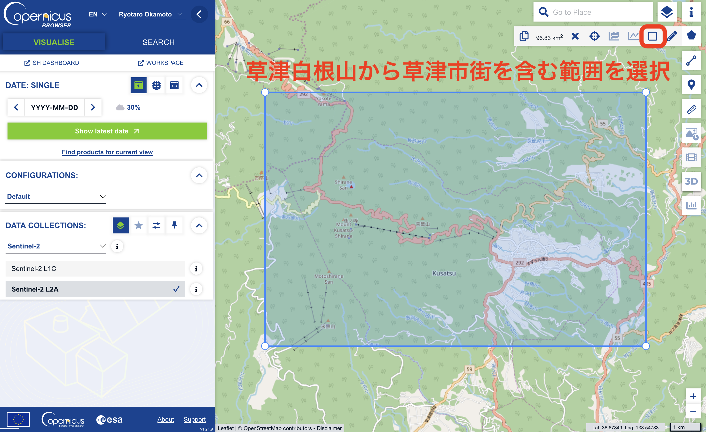
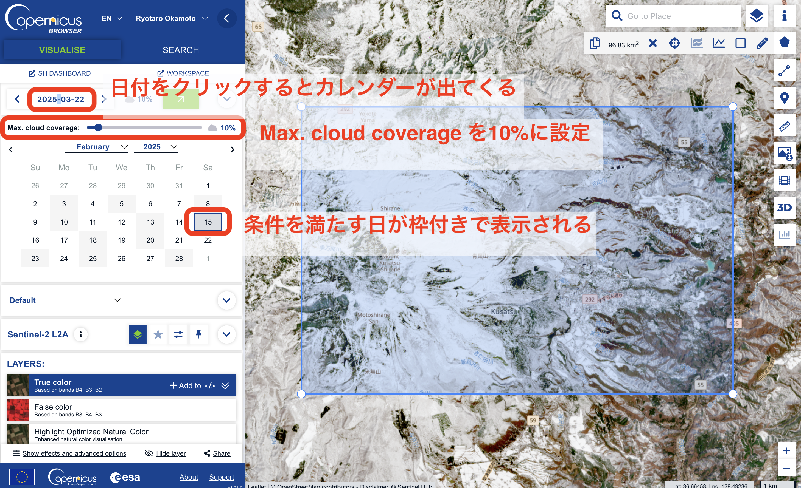
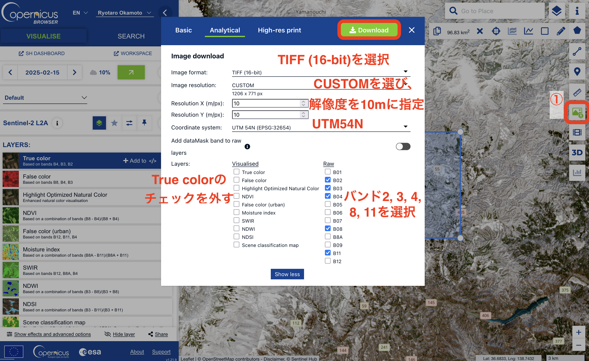

# 衛星画像による生態系観測

この章からはグループワークを含む実践的な解析に取り組んでいきます。まずは、衛星画像を用いたリモセンを体験してみましょう。ここでは、欧州宇宙機関（ESA）が2015年から運用している\[Sentinel-2\](<https://www.restec.or.jp/satellite/sentinel-2-a-2-b.html>)衛星コンステレーション（複数の衛星からなる観測網）のデータを使います。Sentinel-2衛星で撮影された過去画像はオープンデータとして公開されており、誰でも無料で使うことができます。Sentinel-2には他にも、空間解像度や撮影頻度が比較的高い（解像度はバンドによるが最高10m、撮影頻度はおおよそ10日に1回）、可視光から近赤外光まで幅広いバンド（12バンド）の画像が得られるといったメリットがあります。

まずは、解析用のフォルダを`PG2/5/`として作成しましょう。

## 画像の取得

ではまずは、Sentinel-2画像の取得を行ってみましょう。画像の検索・取得には[Coperncus Browser](https://browser.dataspace.copernicus.eu)を使います。まずはアカウントを作成し、ログインしましょう。

ここでは、試しに冬から春にかけての草津温泉周辺の衛星画像を数枚取得し、雪解けや植物の芽吹きの様子を可視化します。

まずは、データが欲しい範囲（Region of Interest, ROI）を指定します。

{fig-align="center"}

草津白根山から草津市街を含む範囲を矩形で選択しましょう。範囲は大体で良いです。

次に、データを検索します。`YYYY-MM-DD`と書かれている場所をクリックするとカレンダーが出てくるので、まずは2025年の2月を選びましょう。画像を検索する際には、雲に覆われている割合が一定以下の画像を選ぶこともできます。ここでは、10%以下の写真を指定します。ここでは、2025/2/15のデータが当てはまったので、これをクリックし、表示します。



それでは、画像をダウンロードしましょう。まず、画面右端に表示されているダウロードボタンを押します。するとダウンロード画面がポップアップで出てくるので、設定を変更します。今回は上部のタブから「Analytical」を選び、諸々の設定を以下のように変えます。「Image Format」は取得する画像の種類と画素値の表現方法を意味しています。ここでは地理座標の紐づいたTIFF形式、画素値は16bit (画素値を$0 - 2^{16}$で表現)を指定します。解像度は10mを指定し、バンドは2(青), 3(緑), 4(赤), 8(近赤外), 11(短波赤外) を選びます。



同様に、2025/3/22、2025/4/21、2025/5/8の画像をダウンロードしましょう。「Browser_images.zip」というような名前のファイルがダウンロードされます。ダウンロードした画像を保管するためのフォルダ「PG2/5/images/」を作り、zipファイルを解凍した中身の画像ファイルを全てこの中にコピーします。images/直下に20枚の画像が保存されているはずです。

## まずはRで読み込む

それではRStudioに移ります。今回は、PG2/5をプロジェクトとして開きましょう。やり方を忘れた人は @sec-create-project を見返してください。

今回から、新しく`patchwork` ライブラリを使います。

コンソールに`install.packages("patchwork")`と入力して実行しましょう。

では以下の内容でRScriptを作成します。名前は`1_plot_s2.R`としておきます。

今回ダウンロードしたファイルは4日分あるので、まずは2025/2/15のデータを処理してみましょう。今回は5つのバンド（B02, B03, B04, B08, B11）をダウンロードしたので、まずはそれぞれ図にしてみます。

```{r}
#| include: true
#| message: false
#| collapse: true

library(terra)
library(tidyverse)
library(tidyterra)
setwd("~/Documents/PG2/5/") #| hide_line

files <- list.files("images/", pattern = "2025-02-15", full.names = TRUE)
band_names <- c("B02", "B03", "B04", "B08", "B11") # 各バンドの名前
image <- rast(files) # 読み込む
names(image) <- band_names # バンド名を与える

ggplot() +
  geom_spatraster(data = image) +
  facet_wrap(~lyr) + # 各レイヤー（バンド）ごとに図を分ける
  theme(
    axis.text.x = element_text(angle = 45) # 経度の文字を斜めにする（重なっちゃうので）
  )
```

次に、見慣れたRGB画像を作ってみましょう。以下を先ほどのスクリプトに書き足します。Sentinel2衛星では、B02が青、B03が緑、B04が赤の波長と対応しているので、これらをそれぞれRGBに当てはめます。

また、今回ダウンロードした画像は各バンドの値が16 bitで入っています。つまり、各バンドの反射率が$0 - 2^{16}$の幅で記録されているということです。したがって、max_col_valueには`2**16`を指定します（`**`は〜乗を意味します）。

```{r}
#| include: true
#| message: false
#| collapse: true
setwd("~/Documents/PG2/5/") #| hide_line
ggplot() +
  geom_spatraster_rgb(data = image, r = 3, g = 2, b = 1, max_col_value = 2**16) # Rに3番目（B04）、Gに2番目（B03）、Bに1番目（B02）のバンドを当てはめる
```

## 様々な指標の計算

衛生画像を使う際の最も基本的な方法は、バンド間で演算を行い、特定の被写体が特徴的に見えるような「指標」を作ることです。こういった指標の代表格がNDVI (Normalized Difference Vegetation Index、正規化植生指数)で、その名の通り植生の有無や状態をとらえるのに適した指標になっています。

NDVIは以下の式で算出できます。

$$
NDVI = \frac{NIR - R}{NIR + R}
$$

ここで、NIRは近赤外域の反射率、Rは赤色の反射率を表します。

植物の葉に含まれる葉緑体中のクロロフィル色素は、赤色光をよく吸収しますが、近赤外光は反射します。NDVIはこの特性を利用し、クロロフィル色素の多い（「元気な」葉の多い）場所では高い値を、そうでない場所では低い値をとります(-1 \~ 1)。NDVIを用いることで、植生のある場所を抽出したり、植生の季節変化（葉が出て枯れるまで）を把握することができるのです。

### NDVI

それでは早速NDVIを算出してみましょう。Sentinel2衛星ではB08とB04を使うことが一般的です。

新しく、`2_ndvi.R`というファイルを作成し、以下を書き込みます。

```{r}
#| include: true
#| message: false
#| collapse: true
library(terra)
library(tidyverse)
library(tidyterra)
setwd("~/Documents/PG2/5/") #| hide_line

# --------
# 画像の読み込み
files <- list.files("images/", pattern = "2025-02-15", full.names = TRUE)
band_names <- c("B02", "B03", "B04", "B08", "B11") # 各バンドの名前
image <- rast(files) # 読み込む
names(image) <- band_names # バンド名を与える

# --------
# NDVIの計算
ndvi <- image |>
  mutate(NDVI = (B08 - B04) / (B08 + B04)) |>
  select(NDVI)

# --------
# 結果のプロット
ggplot() +
  geom_spatraster(data = ndvi) +
  scale_fill_viridis_c() +
  labs(
    title = "NDVI of 2025/2/15" # 図のタイトルは日付にする
  ) +
  theme(
    plot.title = element_text(size = 18, hjust = 0.5) # タイトルの文字サイズと位置を調整
   )
```

### NDSI

別の指標を試してみましょう。今回は雪解けの時期の写真を選んできたので、衛星画像から雪が抽出できたらいいですね。そんな時には、NDSI (Normarized Snow Difference Index)というものを使います。衛星画像から白く見えるものには、雪のほかに雲があります。肉眼ではどちらも似たような色に見えてしまいますが、実はこれらは近赤外域の反射率に着目することで判別可能です。

雪は可視光を強く反射しますが、一方で短波長赤外（Short Wave IR、SWIR、波長1500 nm付近）の光は吸収するのです。したがって、可視光（ここでは緑）とSWIRの反射率を使ってNDVIと同様に指標を作れば、雪に覆われた場所を簡単に抽出することができます。

雪とそれ以外は、NDSI \> 0.42である程度分離できることが[経験的に知られている](https://custom-scripts.sentinel-hub.com/custom-scripts/sentinel-2/ndsi/)ので、この条件によって「雪に覆われた場所」を抽出することが可能です。

新しく、`3_ndsi.R`を作成し、以下を貼り付けます。

```{r}
#| include: true
#| message: false
#| collapse: true
library(terra)
library(tidyverse)
library(tidyterra)
setwd("~/Documents/PG2/5/") #| hide_line

# --------
# 画像の読み込み
files <- list.files("images/", pattern = "2025-02-15", full.names = TRUE)
band_names <- c("B02", "B03", "B04", "B08", "B11") # 各バンドの名前
image <- rast(files) # 読み込む
names(image) <- band_names # バンド名を与える

# --------
# NDSIの計算
ndsi <- image |>
   mutate(NDSI = (B03 - B11) / (B03 + B11)) |>
   mutate(is_snow = NDSI > 0.42) |>
   select(NDSI, is_snow)

# --------
# NDSIのプロット
ggplot() +
   geom_spatraster(data = ndsi |> select(NDSI)) +
   scale_fill_viridis_c() +
   labs(
     title = "NDSI of 2025/2/15" # 図のタイトルは日付にする
   ) +
   theme(
     plot.title = element_text(size = 18, hjust = 0.5) # タイトルの文字サイズと位置を調整
   )

# --------
# 雪の判別結果のプロット
ggplot() +
   geom_spatraster(data = ndsi |> select(is_snow)) +
   labs(
     title = "Snow-covered area of 2025/2/15" # 図のタイトルは日付にする
   ) +
   theme(
     plot.title = element_text(size = 18, hjust = 0.5) # タイトルの文字サイズと位置を調整
   )
```

### NDWI

最後に、NDWIを紹介します。さて、名前の付け方にだんだん慣れてきた頃ではないでしょうか？”W”は何を意味すると思いますか？正解は"Water"です！

水は可視光（ここでは緑）を良く吸収するのに対して、近赤外光を反射します。したがって、この二つで指標を作ると水域が抽出できます。こちらもNDWI \> 0.5が「水かどうか」の[基準になる](https://custom-scripts.sentinel-hub.com/custom-scripts/sentinel-2/ndwi/)ので、この条件で水域を抽出してみましょう。

`4_ndwi.R`というファイルを作成し、以下を貼り付けます。

```{r}
#| include: true
#| message: false
#| collapse: true
library(terra)
library(tidyverse)
library(tidyterra)
setwd("~/Documents/PG2/5/") #| hide_line

# --------
# 画像の読み込み
files <- list.files("images/", pattern = "2025-02-15", full.names = TRUE)
band_names <- c("B02", "B03", "B04", "B08", "B11") # 各バンドの名前
image <- rast(files) # 読み込む
names(image) <- band_names # バンド名を与える

# --------
# NDWIの計算
ndwi <- image |>
  mutate(NDWI = (B03 - B08) / (B03 + B08)) |>
  mutate(is_water = NDWI > 0.5) |>
  select(NDWI, is_water)

# --------
# NDWIのプロット
ggplot() +
   geom_spatraster(data = ndwi |> select(NDWI)) +
   scale_fill_viridis_c() +
   labs(
     title = "NDWI of 2025/2/15" # 図のタイトルは日付にする
   ) +
   theme(
     plot.title = element_text(size = 18, hjust = 0.5) # タイトルの文字サイズと位置を調整
   )

# --------
# 水域の判別結果のプロット
ggplot() +
   geom_spatraster(data = ndwi |> select(is_water)) +
   labs(
     title = "Water-covered area" # 図のタイトルは日付にする
   ) +
   theme(
     plot.title = element_text(size = 18, hjust = 0.5) # タイトルの文字サイズと位置を調整
   )
```

草津白根山の湯釜（火口湖、左）と上州湯の湖（右）が拾えてますね！

NDWIの計算に使ったB03, B08の空間解像度は10mなので、これより細い河川などは拾えてないことに注意しましょう。（雪で埋もれている可能性もあります）

### 他の指標が気になる方へ

<https://sorabatake.jp/5192/>

## 複数の日付の画像をまとめて処理する

さて、次はそれぞれの指標が季節によってどう変わっていくか、特に雪が溶け、緑が芽吹く様子を見てみましょう。さっきと同じことを日付を変えて4回繰り返せばできますが、それは面倒です。

同じ処理を繰り返す必要がある時には、その処理を関数としてまとめておくと便利です。

今回は、

1.  日付を受け取り、その日付の画像を読み込む

2.  画像を受け取り、NDVIを読み込む

関数を作り、ダウンロードした画像を全てまとめて処理するスクリプトを書いてみましょう。

### 関数を作る

まずこちらから始めてみましょう。

Rでは関数は

```{r}
#| eval: false

my_function <- function(受け取る値) {
  やりたい処理
}
```

のように作成するんでしたね。

では冒頭で作成した画像を読み込む処理を関数(`read_sentinel2`)にしてみます。

冒頭のスクリプトでは、`list.files()` の`pattern` という引数に、画像ファイルに含まれる日付の文字列（"2025-02-15"）を入れていました。これを引数にとる関数を作ることで、任意の日付の画像を読むことができるようになります。

新しく、`5_use_function.R` を作成し、以下を貼り付けます。

```{r}
#| include: true
#| message: false
#| collapse: true

library(terra)
library(tidyverse)
library(tidyterra)
setwd("~/Documents/PG2/5/") #| hide_line

read_sentinel2 <- function(date) {
  # dateには、画像ファイル名に含まれる日付のパターンを文字列で入れる
  # 例：read_sentinel2("2025-02-15")
  
  files <- list.files("images/", pattern = date, full.names = TRUE) # 検索パターンをdateにする
  band_names <- c("B02", "B03", "B04", "B08", "B11") # 各バンドの名前
  image <- rast(files) # 読み込む
  names(image) <- band_names # バンド名を与える
  
  return(image)
}

image <- read_sentinel2("2025-02-15")
image
```

ついでに、RGB画像をプロットする関数も作ってみましょう。以下を付け加えます。

```{r}
#| include: true
#| message: false
#| collapse: true
setwd("~/Documents/PG2/5/") #| hide_line

plot_sentinel2_rgb <- function(image) {
  # imageには、read_sentinel2()で読み込んだ画像データを入れる
  ggplot() +
  　geom_spatraster_rgb(data = image, r = 3, g = 2, b = 1, max_col_value = 2**16) +
    theme(
      axis.text.x = element_text(angle = 45) # 経度を斜めに表示
    )
}
```

これらがちゃんと動くか試してみます。

```{r}
#| include: true
#| message: false
#| collapse: true

setwd("~/Documents/PG2/5/") #| hide_line

read_sentinel2("2025-02-15") |>
  plot_sentinel2_rgb()

read_sentinel2("2025-03-22") |>
  plot_sentinel2_rgb()
```

動きました！どうやら、2/15から3/22の間で草津白根山の上部では雪が降ったみたいですね。

それでは最後に、NDVIを計算し、プロットする関数を作ってみます。

以下を付け加えます。

```{r}
#| include: true
#| message: false
#| collapse: true

setwd("~/Documents/PG2/5/") #| hide_line

calc_ndvi <- function(image) {
  # NDVIを計算する関数
  # image にはread_sentinel2()で読み込んだ画像を入れる
  image |>
    mutate(NDVI = (B08 - B04) / (B08 + B04)) |>
    select(NDVI)
}

plot_ndvi <- function(ndvi) {
  # 計算したNDVIを表示する関数
  # ndviには、calc_ndviで計算した結果を入れる
  ggplot() +
    geom_spatraster(data = ndvi) +
    scale_fill_viridis_c() +
    theme(
      axis.text.x = element_text(angle = 45) # 経度を斜めに表示
    )
}
```

こちらも動くか試してみます。

```{r}
#| include: true
#| message: false
#| collapse: true

setwd("~/Documents/PG2/5/") #| hide_line

read_sentinel2("2025-03-22") |>
  calc_ndvi() |>
  plot_ndvi()
```

### まとめて処理する

それでは最後に、これらの関数をダウンロードした画像全部に適用してみましょう。

今回は、4日分の画像があるので、これらの日付をまずはベクトルにしておきます。

0やハイフンを忘れないようにしましょう。

以下を先ほどの`5_use_function.R`に付け加えます。

```{r}
#| include: true
#| message: false
#| collapse: true

dates <- c("2025-02-15", "2025-03-22", "2025-04-21", "2025-05-08")
```

これらに対して、`read_sentinel2()` → `calc_ndvi()` → `plot_ndvi()` という一連の処理をそれぞれ適用させたいわけです。

こういう時には、`map()` 関数というものを使います。`map()` 関数は、

```{r}
#| eval: false
map(ベクトルやリスト, 適用させたい関数名)
```

のように使い、二つ目の引数に入れた関数の処理結果をリスト形式で返します。リストはベクトルと同じようなもので、複数のデータを格納するものです。

複数作られたプロットを並べて表示するには、冒頭でインストールした`patchwork`ライブラリの`wrap_plots()`関数を使います。

したがって、NDVIの表示は以下のように書けます。

```{r}
#| include: true
#| message: false
#| collapse: true
library(patchwork)
setwd("~/Documents/PG2/5/") #| hide_line

dates |>
  map(read_sentinel2) |>
  map(calc_ndvi) |>
  map(plot_ndvi) |>
  wrap_plots()
```

季節が進むにつれてNDVI値が高くなっていくことが見て取れますね！

RGB画像も同様にプロットしてみます。

```{r}
#| include: true
#| message: false
#| collapse: true

setwd("~/Documents/PG2/5/") #| hide_line

dates |>
  map(read_sentinel2) |>
  map(plot_sentinel2_rgb) |>
  wrap_plots()
```

雪も溶けているようです！

ということで、ここで演習問題。

NDWIに関しても、計算する関数、プロットする関数をそれぞれ作り、日毎の雪解けをみてみましょう。

## 第五回の課題

自分たちで選定したエリアのSentinel-2画像をダウンロードし、他の地理情報（DEMデータや行政区画、地理統計など）と組み合わせた解析を実施してください。

解析方法に関しては、\@sec-elevation-by-cities を見返してみると良いと思います。

実施した解析について、以下の4つの項目にしたがって、10分程度でスライドを使いながら説明してください。

1.  背景・目的\
    なぜそのエリアを選び、その解析を行なおうと思ったのかに関する背景と、解析の目的についての説明。
2.  材料・手法\
    使ったSentinel-2画像や地理情報と、行った解析手法に関する簡潔な紹介。
3.  結果\
    解析結果の説明。
4.  考察・展望\
    解析結果から言えること、示唆されることについての提案。背景・目的で提示した目的に対して何が言えそうかを説明。展望では、今後解析を続けるとしたらどのようなことに取り組むべきか、何が期待できそうかについて述べる。

コツは以下の3点です。

-   背景・目的と、考察・展望がきちんと対応してるか気をつける。

-   材料・手法と結果は簡潔さを意識しながら、聞いた相手が作業を再現できるような説明を心がける。

-   スライドは1分1枚が基本。詰め込みすぎないようにする。

発表は次回授業の後半から行います。前半は準備に使えますが、それまでに最低限、見せたい図の作成は終わらせておきましょう。
