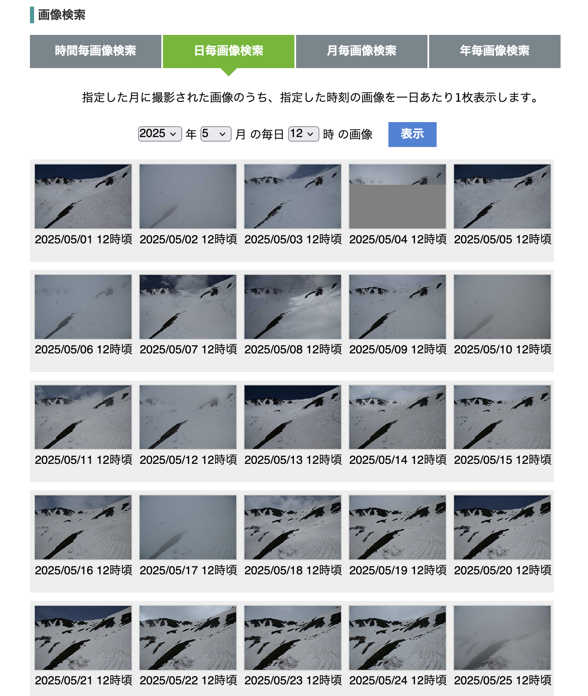

# 地上撮影写真による生態系観測

今回は、地上に設置された定点カメラを用いたリモートセンシングに焦点を当てます。

地上設置カメラは衛星画像や航空写真と比較して撮影範囲は狭いですが、一方で雲に影響されにくい、極めて高頻度な撮影が簡単にできる、安価といったメリットがあります。

例として、日本の高山帯に設置された定点カメラを用いて、融雪・植生の観測を行ってみましょう。

### 国環研高山帯モニタリング

ここでは、サンプルデータとして国立環境研究所の気候変動影響モニタリング事業で収集された画像を例に解析を行ってみます。

<https://db.cger.nies.go.jp/gem/ja/mountain/>

この事業では、高山帯における気候変動影響の観測を目的に、中部山岳域を中心に約30箇所で観測を行っています。 上記ページでは設置された日別、月別、年別で各観測サイトの画像を検索することができます。 ここでは、中央アルプス木曽駒ヶ岳の極楽平を撮影している定点カメラ画像を使ってみます。

### 画像の取得

極楽平の画像を、2025年の5月から10月にかけて各月4枚程度取得します。 まずは、`PG2/6/`以下に`gokuraku_images/`というフォルダを作ります。

次に下記のURLから、「日毎画像検索」をクリックし、2025年5月の毎日12時の写真を検索します。 

<https://db.cger.nies.go.jp/gem/ja/mountain/station.html?id=7>

下の図のように、候補の写真が一覧で出てくるはずです。

{fig-align="center"}

この中から、霧がかかっていないものを4枚程度、できるだけ等間隔に選びます。 5/5, 5/13, 5/20, 5/29が良いと思います。 影も少ないほうが良いです。

各日付のサムネイルをクリックすると新しい画面で画像が開かれます。この状態で右クリックし、「名前をつけて画像を保存」しましょう。 保存先は先ほど作った`gokuraku_images/`です。画像のファイル名は、`2025_0505.jpg`のように`数字四桁_数字四桁.jpg`の形式に変更します。真ん中のアンダーバーを忘れないようにしましょう。

同様に、6,7,8,9,10月についてもダウンロードしていきます。 以下の日付のダウンロードするのがおすすめです……この作業、無駄に大変なので、画像をまとめてGoogleDriveにアップロードしました。[このリンク](https://drive.google.com/drive/folders/1bv26uG-7p69abU_-gtJ8e8Xdi5zJWJUj?usp=sharing)からダウンロードしてZIPファイルを展開し、中身の画像を`PG2/6/gokuraku_images/` 以下に置いてください。

| 6月 | 7月 | 8月 | 9月 | 10月 |
|-----|-----|-----|-----|------|
| 5   | 5   | 4   | 8   | 3    |
| 12  | 13  | 19  | 16  | 7    |
| 18  | 25  | 25  | 21  | 10   |
| 28  | 31  | 28  | 28  | 25   |

### 画像の下処理

稜線より上の空を写した領域は解析に使わないので、まずは空をマスクするための下処理を行います。

RStudioを開いて、`PG2/6` に新しいRProjectを作成します。

以下の内容でRスクリプトを作成します。ファイル名は`mask_sky.R`にしましょう。

ここでは、空が青一色の日を選び、青い部分を抜き出して白黒のマスク画像を作成します。

解析には、前回と同じ`terra`パッケージを使います。`terra` は本来地理情報化されたラスターデータを処理するためのパッケージですが、地理座標の紐づいていない画像も扱うことができます。

```{r}
#| include: true
#| message: false
#| collapse: true

# mask_sky.R

library(terra)
library(tidyterra)
setwd("~/Documents/PG2/6/") #| hide_line

img <- rast("gokuraku_images/2025_0731.jpg") |>
  flip() # 写真は左上が原点で、右下に向かって進む座標系なので反転させないとプロット時に逆さまで表示される

plot(img)

sky <- img |>
  colorize(to = "hsv") |> # HSV色空間に変換
  mutate(sky = (hue > 0.55) & (hue < 0.7) & (saturation > 0.4) & (value > 0.5)) |> # 数字は色々試して決める。要するに、「青くて鮮やかで明るい場所」
  select(sky)

plot(sky) # 概ね悪くないが、左上のテキストボックスを消したい。

# 文字が入っている部分が残っているので上部を塗りつぶす。
row_numbers <- init(sky, "row") # 行数が入ったラスターを作成。
sky <- ifel(row_numbers < 50, TRUE, sky) # 写真は左上原点なので、上から50行目までTRUEで塗りつぶす。
sky <- sky * 255 # PNG画像では、色は0-255で表記するので255倍する（現状は0-1）。

plot(sky) # ちょっと汚いけど、まあ合格でしょう！

writeRaster(sky, "sky.png", overwrite = TRUE) # PNG画像として保存
```

この処理で一つ重要なのは、光の三原色であるRGB（Red, Green, Blue）で表されている色を、[HSV](https://ja.wikipedia.org/wiki/HSV%E8%89%B2%E7%A9%BA%E9%96%93)という別の表記に変えていることです。

HSVはHue, Saturation, Valueの略で、色相、彩度、明度と訳されます。色相は色味のことで、赤から紫にかけて変化する値です。彩度・明度は文字通り色の鮮やかさ・明るさを表します。HSVに変換することで、RGBで表現するより直感的に特定の色（今回の例で言えば「青」）を表現することができるのです。


### 雪渓の融雪過程を調べる

それでは、まずは融雪過程を調べてみましょう。

今回は簡単に、「明るい場所＝雪」として雪を抽出します。

つまり、画像全体を「明るい場所」と「暗い場所」に分けるわけですが、こういった作業を二値化といいます。二値化の方法は色々あり、最もシンプルなのは「明るさ（HSVのvalue）」が特定の値（閾値）より大きいか小さいかで分ける方法です。しかし、これでは晴れた日の写真と曇った日の写真で同じ閾値を使うことができません。

ここでは、[大津の二値化](https://ja.wikipedia.org/wiki/%E5%A4%A7%E6%B4%A5%E3%81%AE%E4%BA%8C%E5%80%A4%E5%8C%96%E6%B3%95)と呼ばれる手法を用いて、自動的に閾値を決定し、画像内で比較的明るい場所を雪として取得します。残雪の量が極端に少なくなってくるとこの手法は機能しないので、5、6月の写真に限定して処理を行います。

```{r}
#| include: true
#| message: false
#| collapse: true

# snow.R

library(terra)
library(tidyterra)
library(tidyverse)
library(patchwork)
library(lubridate)
setwd("~/Documents/PG2/6/") #| hide_line

# 空のマスク画像
sky_mask <- rast("sky.png") |>
  mutate(sky = ifelse(sky > 0, TRUE, FALSE)) # 空はTRUE, 空以外はFALSEにする

# 画像のパスを受け取り、雪を抽出して返す関数
extract_snow <- function(image_path) {
  snow <- image_path |>
    rast() |>
    flip() |>
    colorize(to = "hsv") |> # HSV色空間に変換
    select(value) |> # 明るさを取得
    thresh("otsu") |> # 大津の二値化で明るい部分（雪）と暗い部分に分ける
    c(sky_mask) |> # 空マスクを追加
    mutate(category = case_when(
      sky ~ "sky",
      value > 0 ~ "snow",
      TRUE ~ "non-snow"
    )) |>
    select(category)

  return(snow)
}

# 雪の抽出結果をプロットする関数
plot_snow <- function(snow) {
  ggplot() +
    geom_spatraster(data = snow) +
    scale_fill_manual(
      values = c("#8B8B83", "lightskyblue1", "#EEEEE0"),
      labels = c("Non-snow", "Sky", "Snow")
    ) +
    labs(fill = "Category") +
    theme(
      axis.text = element_blank()
    )
}

# gokuraku_images/以下のJPEGファイル名のベクトルを取得。
images <- tibble(
  files = list.files("gokuraku_images/", ".jpg", full.names = T)
) |>
  mutate(date = ymd(files)) |> # ファイル名から日付を取得
  mutate(month = month(date)) |> # 月を取得
  filter(month <= 6) # 6月までの画像を選択

snows <- images |>
  pull(files) |>
  map(extract_snow)

# とりあえずプロット
snows |>
  map(plot_snow) |>
  wrap_plots(ncol = 2)
```

次に、残雪の量の季節変化を解析してみましょう。

以下を書き足して、雪を抽出したラスターから、空を除いた全画素数に占める雪の画素数の割合を計算します。日付と残雪割合を示したデータフレームを、CSVファイルとして保存しておきましょう。

```{r}
#| include: true
#| message: false
#| collapse: true
setwd("~/Documents/PG2/6/") #| hide_line

# snow.R（続き）

# 雪の画素数の変化を取得
# 空以外の画素のうち、Snowが占める割合を取得する関数
count_snow_pixel <- function(snow) {
  snow_pix <- snow |>
    filter(category == "snow") |>
    expanse() |>
    pull(area)
  non_snow_pix <- snow |>
    filter(category == "non-snow") |>
    expanse() |>
    pull(area)
  return(snow_pix / (snow_pix + non_snow_pix))
}

snow_ratios <- snows |>
  map_dbl(count_snow_pixel)

df_snow <- images |>
  mutate(snow_ratio = snow_ratios)

# CSVファイルに保存
df_snow |>
  write_csv("snow.csv")

df_snow |>
  ggplot(aes(x = date, y = snow_ratio)) +
  geom_point(shape = 8, color = "#5F9EA0", size = 5) +
  labs(
    x = "日付",
    y = "雪の画素の割合"
  ) +
  scale_x_date(date_breaks = "week") +
  theme_light() +
  theme(
    axis.text.x = element_text(angle = 30)
  )
```

雪が減っていく様子がわかりますね！

写真は地理情報化されていない（＝遠い画素と近い画素で実際の面積が違う）ため、この値は残雪面積を必ずしも反映はしていませんが、指標としては使えるでしょう。

## 緑葉フェノロジーの観測

次は、前回扱ったNDVIと同様に、葉が出て枯れるまでの様子を可視化してみます。NDVIの計算には近赤外バンドが必要でしたが、定点カメラでは普通のRGBカメラを使っているため計算できません。そこで、代わりの指標としてGreen Ratio (GR)を使います。

GRは以下のように計算できるシンプルな指標で、定点カメラを用いた植物フェノロジーのモニタリングによく使われます（例: @IdeOguma2010）。

$$
GR = \frac{Green}{Green + Red + Blue}
$$

それでは、全期間を通してGRを計算してみましょう。

新しく、`green_phenology.R` という名前でRスクリプトを作成します。

```{r}
#| include: true
#| message: false
#| collapse: true
setwd("~/Documents/PG2/6/") #| hide_line

# green_phenology.R

library(terra)
library(tidyterra)
library(tidyverse)
library(patchwork)
library(lubridate)

# 空のマスク画像
sky_mask <- rast("sky.png") |>
  mutate(sky = ifelse(sky > 0, TRUE, FALSE)) # 空はTRUE, 空以外はFALSEにする

# 画像のパスを受け取り、Green ratioを返す関数
calculate_gr <- function(image_path) {
  gr <- image_path |>
    rast() |>
    flip() |>
    colorize(to = "hsv") |> # HSVに変換して戻すと、レイヤー名が勝手にred, green, blueになって便利
    colorize(to = "rgb") |>
    mutate(gr = green / (red + green + blue)) |>
    c(sky_mask) |>
    mutate(gr = ifelse(sky, NA, gr)) |>
    select(gr)

  return(gr)
}

# Green ratioをプロットする関数
plot_gr <- function(gr) {
  ggplot() +
    geom_spatraster(data = gr) +
    scale_fill_gradient2(
      high = "seagreen",
      low = "honeydew4",
      mid = "honeydew",
      midpoint = 0.34,
      limits = c(0, 0.8)
    ) +
    theme(
      axis.text = element_blank()
    )
}

# gokuraku_images/以下のJPEGファイル名のベクトルを取得。
images <- tibble(
  files = list.files("gokuraku_images/", ".jpg", full.names = T)
) |>
  mutate(date = ymd(files)) # ファイル名から日付を取得

grs <- images |>
  pull(files) |>
  map(calculate_gr)

# とりあえずプロット
grs |>
  map(plot_gr) |>
  wrap_plots(ncol = 4)
```

季節変化が見えてきましたね。10月末になっても緑が残っているのはハイマツなどの常緑植生です。それではこちらも、日ごとに、空を除いたエリアのGRの平均値を計算して散布図にしてみます。

```{r}
#| include: true
#| message: false
#| collapse: true
setwd("~/Documents/PG2/6/") #| hide_line

# green_phenology.R（続き）

# GRの変化を取得
# 空以外の画素のGreen ratioの平均を算出
calculate_gr_mean <- function(gr) {
  gr |>
    as_tibble() |>
    pull(gr) |>
    mean(na.rm = TRUE)
}

gr_means <- grs |>
  map_dbl(calculate_gr_mean)

df_gr <- images |>
  mutate(gr_mean = gr_means)

# CSVファイルに保存
df_gr |>
  write_csv("df_gr.csv")

df_gr |>
  ggplot(aes(x = date, y = gr_mean)) +
  geom_point(shape = 18, color = "green4", size = 5) +
  labs(
    x = "日付",
    y = "Green Ratioの平均"
  ) +
  scale_x_date(date_breaks = "2 weeks") +
  theme_light() +
  theme(
    axis.text.x = element_text(angle = 30)
  )

```

比較的綺麗に季節変化が出ました。途中一度上がってるのは撮影時の光環境の違いかもしれませんね。

## 紅葉フェノロジーの観測

次は紅葉です。このカメラが設置されている木曽駒岳周辺は紅葉の名所として知られており、秋にはロープウェイが大混雑します。一方、気候変動による紅葉の色づきの悪化も指摘されており（@Koide2025SciRep）、継続的なモニタリングが求められています。

紅葉の度合いは、Red Ratio(RR)で求めてみましょう。式はGRとほぼ同じで、相対的な赤色の強さを表します。

$$
RR = \frac{Red}{Red + Green + Blue}
$$

それでは`autumn_leaf.R` という名前で新しいRスクリプトを作成し、以下を書き込みます。

```{r}
#| include: true
#| message: false
#| collapse: true

setwd("~/Documents/PG2/6/") #| hide_line

library(terra)
library(tidyterra)
library(tidyverse)
library(patchwork)
library(lubridate)

# autumn_leaf.R

# 空のマスク画像
sky_mask <- rast("sky.png") |>
  mutate(sky = ifelse(sky > 0, TRUE, FALSE)) # 空はTRUE, 空以外はFALSEにする

# 画像のパスを受け取り、Red ratioを返す関数
calculate_rr <- function(image_path) {
  rr <- image_path |>
    rast() |>
    flip() |>
    colorize(to = "hsv") |> # HSVに変換して戻すと、レイヤー名が勝手にred, green, blueになって便利
    colorize(to = "rgb") |>
    mutate(rr = (red) / (red + green + blue)) |>
    c(sky_mask) |>
    mutate(rr = ifelse(sky, NA, rr)) |>
    select(rr)

  return(rr)
}

# Red ratioをプロットする関数
plot_rr <- function(rr) {
  ggplot() +
    geom_spatraster(data = rr) +
    theme(
      axis.text = element_blank()
    ) +
    scale_fill_gradient2(
      high = "firebrick1",
      low = "honeydew4",
      mid = "honeydew",
      midpoint = 0.4,
      limits = c(0, 0.8)
    )
}

# gokuraku_images/以下のJPEGファイル名のベクトルを取得。
images <- tibble(
  files = list.files("gokuraku_images/", ".jpg", full.names = T)
) |>
  mutate(date = ymd(files)) |> # ファイル名から日付を取得
  mutate(month = month(date)) |>
  filter(month >= 9)

rrs <- images |>
  pull(files) |>
  map(calculate_rr)

# とりあえずプロット
rrs |>
  map(plot_rr) |>
  wrap_plots(ncol = 3)
```

後ろから4枚目の写真（10/3）がピークっぽいですね。

また、紅葉しないハイマツなどを区別することもできそうです。

それでは次は、紅葉・落葉してる植生のみに着目して、写真ごとにRRの平均値を求め、時系列でプロットしてみましょう。

```{r}
#| include: true
#| message: false
#| collapse: true
setwd("~/Documents/PG2/6/") #| hide_line

# autumn_leaf.R（続き）

# RRの全期間での最大値を画素ごとに出す
# 「RRの最大値 > 0.4」という条件で常緑樹（ハイマツ）と裸地を除けそう

autumn_leave_mask <- rrs |>
  reduce(c) |> # 一つのラスターにレイヤーとしてまとめる
  max() |>
  mutate(al = max > 0.4) |>
  select(al) # 「紅葉・落葉する植生か」

plot(autumn_leave_mask)

calculate_rr_mean <- function(rr) {
  rr |>
    c(autumn_leave_mask) |>
    filter(al) |> # al がTRUEの場所（紅葉・落葉する植生）だけ抽出
    as_tibble() |>
    pull(rr) |>
    mean(na.rm = TRUE)
}

rr_means <- rrs |>
  map_dbl(calculate_rr_mean)

df_rr <- images |>
  mutate(rr_mean = rr_means)

# CSVファイルに保存
df_rr |>
  write_csv("df_rr.csv")

df_rr |>
  ggplot(aes(x = date, y = rr_mean)) +
  geom_point(shape = 18, color = "#FF4040", size = 5) +
  labs(
    x = "日付",
    y = "Red Ratioの平均（常緑植生・裸地を除く）"
  ) +
  scale_x_date(date_breaks = "week") +
  theme_light() +
  theme(
    axis.text.x = element_text(angle = 30)
  )

```

ここでは、常緑植生や裸地を解析から除外するために、「全期間を通したRRの最大値が一定以上であれば解析に使う」という方針にしました。紅葉は期間が短いので、緑葉と比べてシャープな形になりましたね。

## 全部まとめてプロットしてみる

最後に、これらの結果を全てまとめて時系列プロットを作成します。これまでの解析では、日付と残雪割合や、日付とGR/RR平均の対応をCSVファイルに保存していました。これを読み込んで一つのデータフレームにし、重ねてプロットしてみます。

残雪面積は0-1の値を取るのに対して、GR/RRの値は0.3-0.7程度に限られています。従って、今回はグラフの左右に二つy軸を描画することにしました。

そのせいでちょっとスクリプトが複雑ですが、そういうものだと思って動かしてみましょう（僕も調べながら書きました）。

`plot_all.R`というRスクリプトを作成します。

```{r}
#| include: true
#| message: false
#| collapse: true
setwd("~/Documents/PG2/6/") #| hide_line

# plot_all.R（続き）
library(tidyverse)

df_snow <- read_csv("snow.csv")
df_gr <- read_csv("df_gr.csv")
df_rr <- read_csv("df_rr.csv")

# "date" 列を基準にしてデータフレームを結合していく。
# 解析対象の日付範囲がそれぞれ異なるため、解析結果がない部分（e.g., 秋の残雪割合）についてはNAが挿入される。

df <- df_snow |>
  full_join(df_gr, by = "date") |>
  full_join(df_rr, by = "date") |>
  select(date, snow_ratio, gr_mean, rr_mean)

df

# プロットする
# 残雪割合の値は、GR/RRと同じくらいの範囲に入るようにリスケールしてプロットする
# scale_y_continuous(sec.axis = ...)で二番目の軸(残雪割合)を作成する
# この際、軸の目盛りには先ほどのリスケールの逆の処理を施し、元々の残雪割合の値が表示されるようにする

df |>
  ggplot(aes(x = date)) +
  geom_point(aes(y = gr_mean), shape = 18, color = "green4", size = 5) +
  geom_point(aes(y = rr_mean), shape = 18, color = "#FF4040", size = 5) +
  geom_point(aes(y = snow_ratio / 5 + 0.3), shape = 8, color = "#5F9EA0", size = 5) +
  geom_line(aes(y = gr_mean), color = "green4") +
  geom_line(aes(y = rr_mean), color = "#FF4040") +
  geom_line(aes(y = snow_ratio / 5 + 0.3), color = "#5F9EA0") +
  scale_y_continuous(
    position = "right",
    sec.axis = sec_axis(~ (. - 0.3) * 5, name = "残雪の割合")
  ) +
  labs(x = "日付", y = "GR・RR")
```

雪解けと共に緑葉の展開が始まり、緑葉期が終わると紅葉が訪れることが綺麗にわかります。

例えば融雪時期や気温の異なる他の年で同様の解析をしてみると、緑葉開始日や紅葉のピーク日が何によって規定されているかわかるかもしれません。降雪量や気温、標高の異なる山域間で比較してみるのも面白いでしょう。

## 発展例：岡本の博論紹介

これまでの解析では、解析結果は写真の中での相対的な割合であり、地理情報としては用いることができません。例えば、初めに作成した残雪割合は、あくまで写真内の画素の割合であって、残雪面積ではありませんでした。

地上撮影写真は従来地理情報化が困難でしたが、僕の博士課程時代の研究（@Okamoto2024RSEC）ではこれを実現するプログラムを作成し、定点カメラ写真から植生分布の変化や残雪面積の変化を測定する手法を開発しました。

[プレスリリース：山小屋カメラを高山植生モニタリングに活用](https://www.nies.go.jp/whatsnew/2023/20230926-2/20230926-2.html)

プログラムは（Python言語ですが）パッケージとして公開されているので、必要に迫られた際にはぜひ使ってみてもらえると嬉しいです。

[山の地上撮影写真を地理情報化するためのPythonパッケージ "alproj"](https://github.com/0kam/alproj)

## 第六回の課題

国環研高山帯モニタリングの定点カメラ写真を用いて、何かしらの解析をしてみましょう。
上記で試した融雪・緑葉・紅葉以外に着目しても構いません（例：天気）。

-   撮影地間の比較

-   撮影年間の比較

-   気象データなどとの比較

のいずれか一つ以上を盛り込んで、解析を行ってみてください。目的と考察の対応づけを忘れないように！

注意事項ですが、サイトによってはカメラが時々動いてしまい、今回行ったような空のマスクなどができない場所もあります。また、機器の故障で長期間欠測になっていることもあります。解析対象のサイトを選ぶ際には、これに気を付けてください。

（僕は初め涸沢雪渓の写真を使ってこの資料を書いていたのですが、写真を全部ダウンロードしてから位置ずれが大きくて使えないことに気づきました…）

それではまた次回！