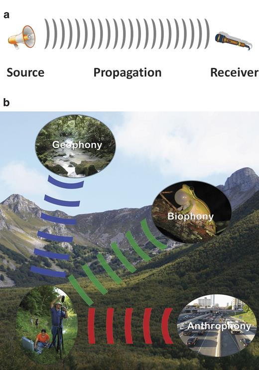
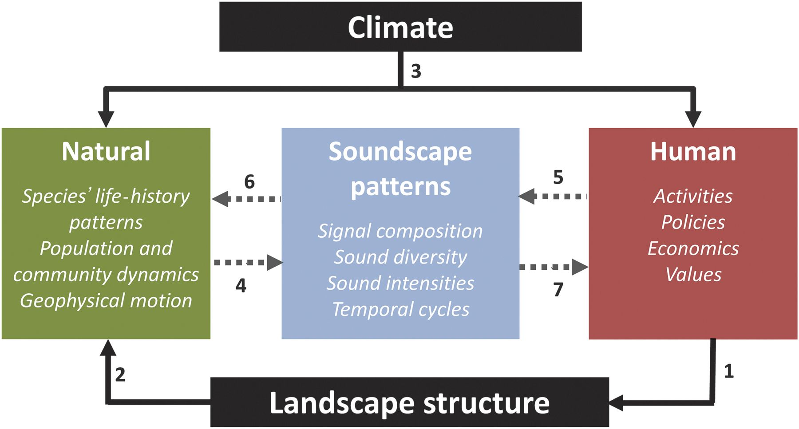
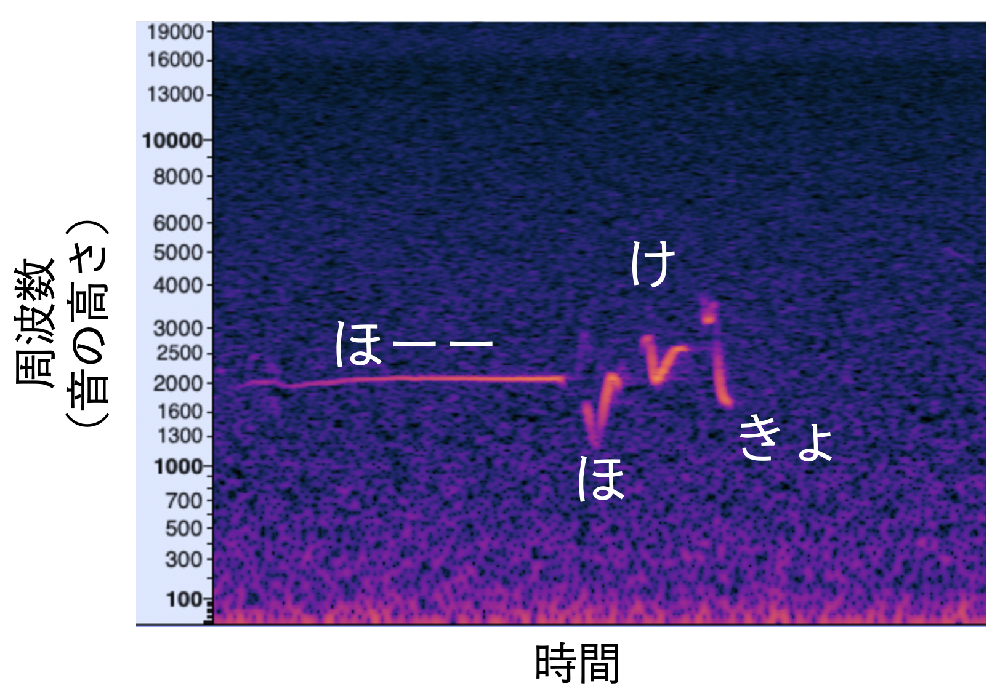
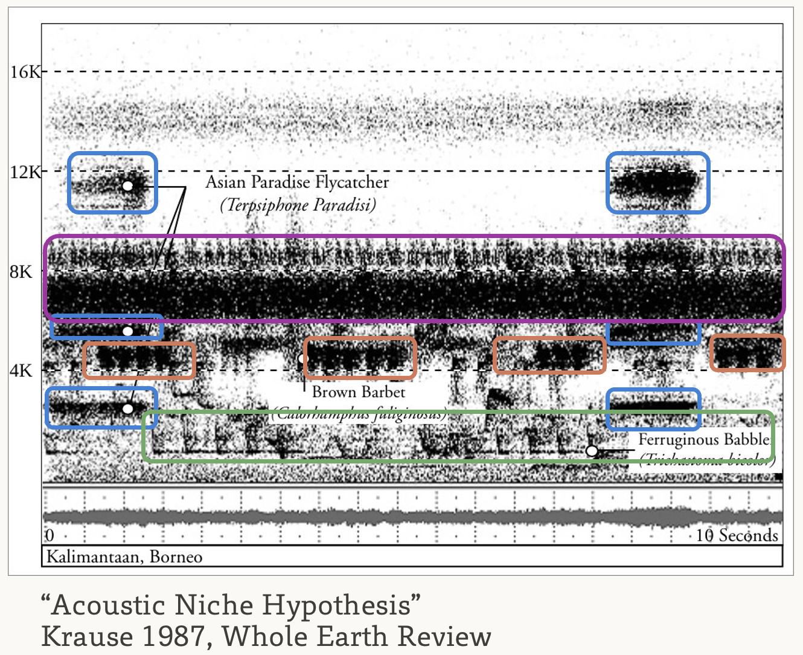
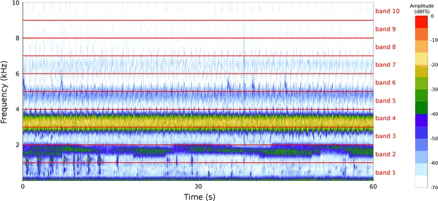

# 音響データによる生態系観測

今回は少し趣向を変えて、音響を介した生態系の観測に着目してみましょう。

## 背景

自然界では、多くの生き物が音を使ってコミュニケーションしています。鳥類やセミや秋の虫などの昆虫類は求愛や群れの仲間とのコミュニケーションのために鳴きますし、コウモリやイルカは音を使って獲物の位置を特定します。音は繁殖や捕食といった生き物にとって極めて重要な局面で用いられているわけです。

### 鳴き声を用いた生物多様性観測

鳴き声は同種個体間のコミュニケーションに用いられるため、多くの場合、種ごとに特徴が異なります。従って、野外に音響レコーダーを設置して環境音を録音し、含まれる鳴き声を調べることで、そこに生息する種をモニタリングすることができます。鳴き声は比較的遠くまで届くため、音響観測は広い範囲を効率的に調べられる点も利点です。

また、鳴き声でコミュニケーションする生物は、トラップカメラなどの視覚的な手法では観測が難しいケースが多いことも知られています。近年では、防水性を備え、指定した時刻に自動で録音できる音響レコーダーも普及しており、これらを用いた鳥類や昆虫類の観測は、手軽に長期的な生物多様性モニタリングを行う手法として注目されています。

[参考：岡本が使っているレコーダー](https://0kam.net/blog/posts/songmeter_extra_battery/)


### 音を介した生物と生物、生物と人間の接点

さらに、音響の面白い点は、その混じりやすいさにあります。例えば、道路と川に面した緑地を考えてみましょう。当たり前の話ですが、緑地に生息している鳥類や昆虫類の鳴き声は、道路を走る車の走行音や川を流れる水の音と重なり合い、聞こえづらくなるかもしれません。これはつまり、人や環境の生み出す音が生物の行動に影響しうることを意味します。実際、道路騒音が鳥類の鳴き声のパターン（@Slabekkoorn2006CB）や、繁殖成功率（@Senzaki2020Nature）に影響を及ぼすことが知られています。

参考：道路騒音が引き起こすバッタの植生変化 

### Soundscape Ecology

もう少し、音と地理学的な対象の関係について整理してみます。ここでは、@SoundscapeEcology を参考にしながら、人間による土地利用や地理的な条件がどのようにその場所の音に影響するか考えてみます。この総説、大変読みやすく面白いのでおすすめです。英語が苦手な方はAIに翻訳させてみても良いでしょう。

まずタイトルにある"Soundscape"ですが、これは"Landscape"と対応した語彙で、日本語では「音響景観」と訳されることもあります（「サウンドスケープ」と書かれることの方が多いかもしれません）。生態学の文脈では「景観」というのは複数のタイプの生態系からなる、あるエリア全体のことを指します。同様に、「サウンドスケープ」はそのエリアにおける環境音の総体を指します。

サウンドスケープに含まれる音は、その起源から三種類に分類されます。

-   生物音（Biophony）: 生物が出す音。鳴き声や羽ばたき音など。\
-   自然音（Geophony）: 非生物的な環境に起因する音。川のせせらぎ、風、雨など。\
-   人工音（Anthrophony）: 人間に起因する音。車の走行音、工場の稼働音、エアコン室外機の音など。



サウンドスケープはその場の景観と強く関連しています。 以下の図を見てみましょう。

ある場所の景観は、気候と景観構造（土地利用の空間分布など）によって概ね規定されます。 人はその場所の景観構造を変化させ（1）、それによって生物の分布や行動が変わります（2）。

このような中で、人間活動の変化や、その自然に対する現象はその場所のサウンドスケープに反映されます（4,5）。 たとえば、都市化が進んで道路騒音が増えたり、生き物が減って鳴き声頻度が減ったりします。

時には、サウンドスケープを介して人と自然の間に相互作用が働くこともあります（5-\>6, 4-\>7）。 たとえば、道路騒音によって鳥類の活動が制限されたり、あるいは秋の鳴く虫の種組成の変化によって、人が心地よいと思う音が街から減っているかもしれません（"ウェルビーイング"の低下?）。

[参考：なんで虫の鳴き声って心地よく聞こえるの？オーケストラになっているから（チコちゃんに叱られる）](https://チコちゃんに叱られる.com/26497.html)

ある場所におけるサウンドスケープがどのようになっているか、それが人と自然のどのような関係を反映しているかを調べるのが、Soundscape Ecologyです。



### 音響データの基礎

音響データを取り扱う際に必要となる基礎的な知識について概説します。

まず基本的な話として、音は空気中を伝わる振動（波）です。 音の大きさは波の高さ（振幅）と対応しており、音の高さは波の頻度（周波数）と対応しています。

一方、波形データは視覚的に理解しにくいため、横軸を時間、縦軸を周波数、明るさを音の強さに対応させた2次元のヒートマップを作成することが多いです。このような図のことを**スペクトログラム**と呼びます。

たとえば下図はウグイスのさえずりを示すスペクトログラムです。 明るい部分の動きが、音の高さの変化に対応しています。



スペクトログラムと波形の対応を動画にしてみました。



波形をズームしていくと、点が見えてきます。 音の波形をデジタルデータにする際には、一定の間隔で波形の高さ（音圧）をサンプリングしており、それぞれの点が対応しています。 このサンプリングの間隔のことをサンプリングレートと呼び、高ければ高いほど、より高音域まで録音ができることを意味します。

動画の例では、48kHz（Hz、ヘルツ、は1秒間に1回、という意味の単位です）で録音を行なっているので、点の間隔は1/48,000秒です。

後段ではRを使ってスペクトログラムを作成しますが、[Audacity](https://www.audacityteam.org/) などのフリーソフトを使って作成することもできます。Audacityではスペクトログラムの拡大や音声の再生もできるので、音をまずまず見て聞いてみるのに便利です。

#### 音響ニッチ仮説

スペクトログラムを用いてわかる現象として面白いものを一つ紹介します。

下の図は @Krause1987 で紹介されたボルネオのスペクトログラムです。色のついた枠は、鳴き声の種を表しています。

全体として、スペクトログラム全体を枠が覆っており、さらに、各枠は重なりが少ないことがわかります。

各種は鳴くタイミングをずらしたり、鳴き声の高さを他の種と被らないようにすることで、自分の鳴き声が相手（求愛相手など）に届きやすくしているのです。

つまり、各種は周波数と時間で示される音響空間の中で、特定の位置（ニッチ）を獲得していると考えられ、このような仮説を「音響ニッチ仮説（Acoustic niche hypothesis）」と呼びます。



### 音響景観指数

環境音の解析方法にはいくつかやり方があります。 一番思いつきやすいのは、機械学習を使って特定の種の鳴き声を調べることです。 鳥についてはある程度使えるモデルが出来上がっているので、後半で試します。

他の（もっと簡単な）方法として、音響景観指数（Soundscape Index）を計算する、というものがあります。

これは、環境音の特徴を指標化しようというもので、（場合によるものの）鳥類の多様性や人工音の強さを反映するとされています。

ここでは、代表的な音響景観指数を3つ紹介します。

#### Normalized Difference Soundscape Index (NDSI, @Kasten2012NDSI)

どこかでみたことのある名前ですね...衛星リモセンの回で出てきた指数（NDVIなど）と名前が似ています。
この音響景観指数も、NDVIなどと似た計算方法で算出されるものです。

NDVIでは、植生が反射する波長、吸収する波長の反射率の差をとって、植生の有無を推定しました。
NDSIでは、生物音は比較的高い周波数を持っており、人工音はそれに比べて低い周波数に集中している（道路騒音とか、エンジン音とか、そうですよね）ことを利用し、同様の計算を行います。

つまり、人工音と生物音それぞれの周波数帯を定義し、それぞれ音圧を計算したのち、

$$
NDSI = \frac{生物音 - 人工音}{生物音 + 人工音}
$$
のようにして計算することで、相対的な生物音の強さ（高い音の大きさ）を出すわけです。

#### Acoustic Complexity Index (ACI, @Pieretti2011ACI)

ACIは時間方向のパターンに着目した指標です。
鳥の鳴き声は短い時間に高さが頻繁に変わりますが、人工音は一定の強さで持続するものが多いです。

ACIでは、音響データの時間的な複雑性を指標化します。

- まず音響データをいくつかのセグメント（5秒とか）に分割します。  
- さらにセグメントを周波数帯で分割します（1 kHz刻みとか）  
- 隣接するセグメント間で周波数帯ごとに音圧の差を計算します  
- 上記の差を合計したものがACIです。

#### Acoustic Diversity Index (ADI, @Rivera2011LE)

ADIはその名の通り、音の周波数の多様性に着目した指標です。
音響データを周波数帯で分割し、周波数帯ごとに、どれくらいの時間音が鳴っているかを調べます。
計算された「周波数帯ごとの音の有無」からShannon指数を計算します。

ADIは、周波数帯全体に均一に音が鳴っている時にもっとも高くなり、特定の周波数帯にだけ音が偏っている時に低くなります。



## Rを用いた環境音の解析

それでは実際に音響データを用いて解析を行ってみましょう。 まずは作業用のディレクトリ（`PG2/7/`）を作成します。

次に、Rプロジェクトを`PG2/7/`以下に作成します。 やり方を忘れた方は @sec-create-project を見直してください。

必要なライブラリをインストールします。 今回は音の読み込みに`tuneR`、スペクトログラムの作成に`seewave`、「音響景観指数（後述）」の計算に`soundecology`、鳥の鳴き声検出に`birdnetR`を使います。

コンソールで以下を実行してください。

```         
install.packages(c("tuneR", "seewave", "birdnetR", "soundecology"))
```

### サンプル音源のダウンロード
試しに使えるサンプル用の音源を用意しました。
[Google Drive](https://drive.google.com/drive/folders/12Nap_v2FIGz-b53MIRRsdPm83uwLBuIk?usp=sharing)にアップロードしたので、各自ダウンロードし、`PG2/7/audio/`以下に各wavファイルを置いてください。

```
# audio/直下にwavファイルを置くこと！
PG2
└── 7
    ├── audio
        ├── entrance_hall.wav # リバティタワー1階のホールでの録音
        ├── mainroadside.wav  # 靖国通りの路上での録音
        ├── roadside.wav      # 明大通りの路上での録音
        └── mountain.wav      # 南アルプス千枚岳付近の亜高山帯樹林での録音（2024年8月）
```

### スペクトログラムの作成

まずはスペクトログラムを見てみます。

以下を`spectrogram.R`として作成しましょう。

```{r}
#| include: true
#| message: false
#| collapse: true
#| results: hide
#| fig-keep: all

# spectrogram.R

library(tidyverse)
library(seewave)
library(tuneR)

setwd("~/Documents/PG2/7/") #| hide_line

plot_spectrogram <- function(file_name) {
  readWave(file_name, from = 0, to = 20, units = "seconds") |>
    spectro(osc = TRUE, flog = TRUE, main = basename(file_name), collevels = seq(-50, 0, 1))
}

files <- list.files("audio/", ".wav", full.names = TRUE)
files |>
  map(plot_spectrogram)
```

mountains.wavだけ明かに他と違いますね。鳥の鳴き声はロードノイズ等と比較してかなり高いことがわかります。

### 解析1. 音響景観指数（Soundscape Index）

それでは、各音源に対してNDSI、ACI、ADIを計算してみましょう。

重要な点として、音源の長さが変わると指数の値に影響します。したがって、ここでは各音源の初めの20秒だけを使うようにしました。

NDSIでは生物音は2 kHz - 10 kHz、人工音は1 kHz - 2 kHzとして定義しました。

ACIの計算時には、1 kHz - 10 kHzの音のみを対象としています。

ADIでは、0 kHz - 10 kHzの音を対象としました。

また、ADIの計算時には、周波数バンド（１kHz刻み）ごとの相対的な音量も計算されますので、これもプロットしてみます。

以下を`index.R`として作成します。

```{r}
#| include: true
#| message: false
#| collapse: true
#| results: hide
#| fig-keep: all

setwd("~/Documents/PG2/7/") #| hide_line

# index.R

library(tidyverse)
library(seewave)
library(tuneR)
library(soundecology)

# 音響景観指数を計算する関数
calculate_index <- function(file) {
  wave <- readWave(file, from = 0, to = 20, units = "seconds") # 0-20秒を切り出す
  ndsi_value <- ndsi(wave, anthro_min = 1000, anthro_max = 2000, bio_min = 2000, bio_max = 10000)$ndsi_left
  aci_value <- acoustic_complexity(wave, min_freq = 1000, max_freq = 10000, j = 3, fft_w = 64)$AciTotAll_left
  adi_result <- acoustic_diversity(wave, max_freq = 10000)
  adi_value <- adi_result$adi_left
  result <- tibble(
    filename = basename(file),
    ndsi = ndsi_value,
    aci = aci_value,
    adi = adi_value
  )
  
  return(result)
}

# 周波数バンドごとの音量を計算する関数
calculate_band_values <- function(file) {
  wave <- readWave(file, from = 0, to = 20, units = "seconds")
  adi_result <- acoustic_diversity(wave)
  band_values <- tibble(
    filename = basename(file),
    freq = adi_result$left_bandrange_values,
    value = adi_result$left_band_values
  )
  return(band_values)
}

# 各ファイルに対して音響景観指数を計算し、データフレームにまとめる
index <- files |>
  map_dfr(calculate_index)

# 周波数バンドごとの音量も各ファイルに対して計算
band_values <- files |>
  map_dfr(calculate_band_values)
```

結果を見てみましょう。以下を書き加えます。

```{r}
#| include: true
#| message: false
#| collapse: true

# index.R（続き）

setwd("~/Documents/PG2/7/") #| hide_line

index

# プロットしてみる
band_values |>
  ggplot(aes(x = freq, y = value, fill = filename)) +
  geom_bar(stat = "identity") +
  facet_wrap(~filename) +
  coord_flip()
```

全ての指標に置いて、mountain.wavがずば抜けて高い値になっていますね！
周波数ごとの相対的な音圧をみてみると、mountain.wavでは4-5 kHz帯にもピークがあることがわかります。

この音源に含まれる鳥の鳴き声がこれくらいの周波数だったということですね。

それでは、この音源には、どのような鳥が含まれているのでしょうか？

### 解析2. BirdNETで鳥の鳴き声を調べる

次に、深層学習モデルを使って鳥の鳴き声を検出する手法を紹介します。

ここでは、@birdnet で提案されたBirdNETと呼ばれる深層学習モデルを用います。
BirdNETは米国のコーネル大学が開発した全世界の鳥類の鳴き声を分類するモデルで、[デスクトップアプリ](https://github.com/birdnet-team/BirdNET-Analyzer)や[モバイルアプリ](https://birdnet.cornell.edu/)にもなっています。

BirdNETは3秒間の音響データを受け取り、その中に含まれる鳥の鳴き声を検出します。

今回はせっかくなので、Rから使ってみましょう。

```{r}
#| include: true
#| message: false
#| collapse: true

setwd("~/Documents/PG2/7/") #| hide_line

library(birdnetR)
library(tidyverse)

model <- birdnet_model_tflite(language = "ja") # 初回はダウンロードに結構（10分間くらい）時間がかかる
predictions <- predict_species_from_audio_file(model, "audio//mountain.wav") |>
  as_tibble() |>
  drop_na()

predictions
```

「アメリカキバシリ」や「アメリカキクイタダキ」など、明かに日本にいなさそうな鳥が多数含まれていますね。 BirdNETは北米や欧州で取得された音源を多く用いて訓練されているため、北米・欧州の種が誤って出やすい傾向にあります。

この問題に対処するために、BirdNETには録音場所の大まかな緯度経度と季節から、各種がどの程度出現してそうかを予測するモデルが用意されています。このモデルを組み合わせてフィルタリングしてみましょう。

```{r}
#| include: true
#| message: false
#| collapse: true

setwd("~/Documents/PG2/7/") #| hide_line
meta_model <- birdnet_model_meta(language = "ja")
predictions_meta <- predict_species_at_location_and_time(
  meta_model,
  latitude = 35.5, # 大体の緯度経度
  longitude = 138.2,
  week = 30 # 年の中での週。元日から数えて8月は大体30週目くらい。
) |>
  mutate(scientific_name = str_remove(label, "_.*")) |> # labelは 学名_和名の形式になっているので_以降を削除
  rename(confidence_meta = confidence) |>
  select(scientific_name, confidence_meta) |>
  as_tibble()


predictions_with_meta <- predictions |>
  left_join(predictions_meta, by = "scientific_name")

predictions_with_meta
```

明かに日本にいなさそうな種はconfidence_metaがNAになっていますね。 今回は便宜的に、`confidence_meta > 0.15` を満たす種のみを抽出します。

種ごとの鳴き声検出数をグラフにしてみましょう。

```{r}
#| include: true
#| message: false
#| collapse: true

setwd("~/Documents/PG2/7/") #| hide_line

predictions_with_meta <- predictions_with_meta |>
  drop_na() |> # confidence_metaがNAのものを消す
  filter(confidence_meta > 0.15) 

predictions_with_meta |>
  write_csv("birdnet_preds_mountain.csv")

predictions_with_meta |>
  ggplot(aes(x = common_name, fill = common_name)) +
  geom_bar() +
  theme(
    axis.title.y = element_blank(),
    axis.title.x = element_text(size = 14),
    axis.text = element_text(size = 12),
    legend.position = "none"
  ) +
  labs(y = "BirdNETでの検出数（3秒単位）") +
  coord_flip()
```

結果が出ました！地域で絞り込んでいるとはいえ、BirdNETは結構間違えます。

鳴き声を自分で聞いてみて、合ってそうか確認したほうが良いでしょう。

[サントリーのHP](https://www.suntory.co.jp/eco/birds/encyclopedia/nakigoe.html)にはわかりやすい鳥の鳴き声図鑑があるので、これを参考に聞き比べてみるのがおすすめです。

## 第6回の課題

- **3箇所以上の場所で実際に自分たちで音を録音して**解析してみましょう。  
- 解析には、（最低限）音響景観指数の計算を含めましょう。鳥の鳴き声を調べてもいいです。  
- 解析結果を考察し、**土地利用やエリアの特性がその場所のサウンドスケープとどう繋がっているか**考察してください。  
- その場所を使う人にとって、現状のサウンドスケープがどのように感じられるか、それがどのようになると好ましいかについて述べることを歓迎します（岡本の個人的興味）。 
- なお、録音はプライバシーを害しかねない行為です。私有地での録音は避け、人の話し声が聞き取れる形で録音されないように気をつけましょう。
