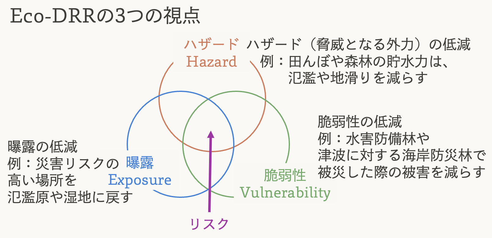
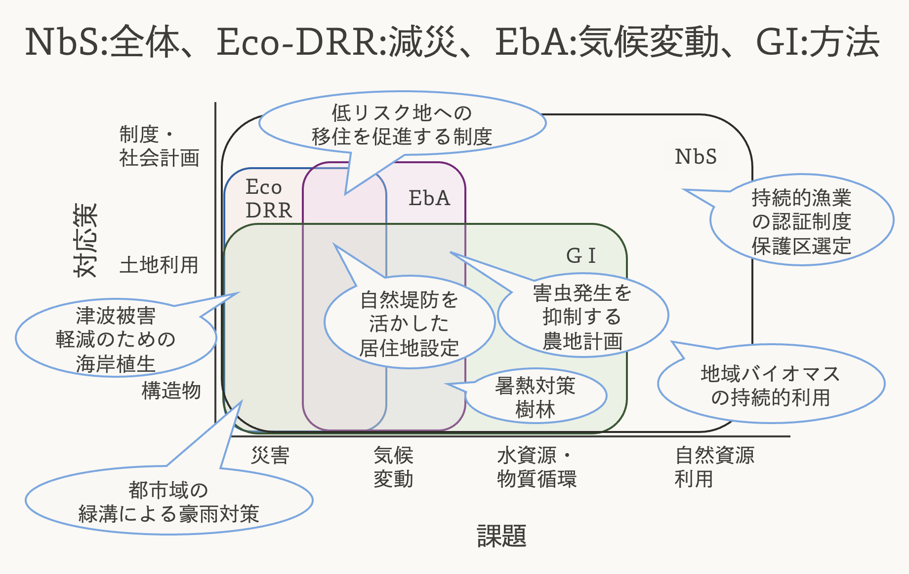

# 自然地理学と社会

本授業の最後に、ここまで取り扱ってきた内容（生態系の観測やモデリング）が社会でどのように活用されるのか、将来の自然の人間社会の関係性について、最近注目されているキーワードをいくつか挙げながら紹介します。

## [グリーンインフラ（GI）](https://www.mlit.go.jp/common/001179745.pdf)

さて、まずは人間社会において地理学と密接に関わっているもの、「インフラ」について考えてみます。インフラと聞いて、みなさん何を思い浮かべますか？道路やダム、防潮堤、発電所など、コンクリートでできた人工物を思い浮かべる方が多いと思います。

一方で、例えば河川に接続する湿地や氾濫原には洪水時に水の流下を遅くし、下流の市街地での水害を抑制する機能があったり（@Nishihiro2020SGI）、マングローブ林には高波を抑える防潮堤としての機能があります（@Kathiresan2005ECSS）。このような、自然の持つ多面的な機能を活用したインフラのことをグリーンインフラと呼びます。

グリーンインフラに関しては国交省が[事例集](https://www.mlit.go.jp/common/001180165.pdf)を出していたり、[書籍](bookplus.nikkei.com/atcl/catalog/17/259720/)も複数出ているので、ぜひ興味がある方は参考にしてみてください。

しかしダムや道路も、その場所の自然地理学的な条件に無関係に建てられているわけでは（当然）ありません。最近では、自然の構造や機能を基盤に、グリーン・グレー問わずインフラを捉える「トータルインフラ」という概念を考えている[人](https://note.com/jnishihiro/n/n2965f66bda33)もいるようです。

GIの持つ特徴としてよく指摘されるのは、機能の「多面性」です。例えば治水について考えてみましょう。人工のダムは治水能力ではGIよりも一般に高い能力を発揮しますが、一方で湿地や氾濫原といったGIには希少な湿地植生の保全や炭素固定、レクリエーション価値の創出といった多面的な機能があります。さらに、GIはインフラとしての持続可能性やレジリエンスに関しても優れているとされています（@Iwasa2017GI）。

## [Nature based Solutions (NbS)](https://www.env.go.jp/nature/biodiversity/nbs.html)

GIの根本的な発想は、「自然の持っている機能を社会に活かす」というものでした。このアイデアをより一般に指す用語が「Nature based Solutions, NbS」です。NbSはIUCN（国際自然保護連合）が2009年に提唱した考え方で、気候変動や自然災害、水や食糧供給といった切迫した社会課題の解決に自然の持つ機能を活用しようというものです。

より。](images/9/iucn.png)

NbSの中でも、特に注目されているのが、災害や気候変動に対するNbSです。これらはそれぞれ「Eco-DRR」、「EbA」と名前がついているので、こちらも紹介します。

## [Ecosystem-based Disaster Risk Reduction （Eco-DRR）](https://www.env.go.jp/guide/info/ecojin/eye/20230913.html)

Eco-DRRは生態系の保全・再生を通じて防災・減災と生物多様性の回復を両立しようという考え方です。日本語では「生態系を活用した防災・減災」と訳されます。

防災・減災は一般的に、ハザード、曝露、脆弱性の低減という3つの視点に分けることができます。 Eco-DRRにおいても、この3つの視点から防災・減災を考えることが重要です。

Eco-DRRに関しては環境省から[手引きやハンドブック](https://www.env.go.jp/nature/biodic/eco-drr.html)が出版されていますので、参考にしてください。

## [Ecosystem-based Adaptation（EbA）](https://www.env.go.jp/content/000305888.pdf)

気候変動対策には、1. 温室効果ガスを削減する「緩和」と2. 気候変化の悪影響を低減する[「適応」](https://adaptation-platform.nies.go.jp/climate_change_adapt/)の二つがあります。2018年には[気候変動適応法](https://www.env.go.jp/earth/earth/tekiou/page_00608.html)が制定され、国、地方公共団体、事業者、国民のそれぞれが適応の推進を担うことが明確化されました。気候変動適応に関する情報は、国環研の[「気候変動適応情報プラットフォーム」](https://adaptation-platform.nies.go.jp/)にまとまっているので是非覗いてみてください。

気候変動対策においても、自然を活用した対策によって生物多様性の保全・回復と両立させようという考え方があり、生態系を活用した気候変動適応策（EbA）と呼びます。

適応策には水害対策のようなEco-DRRと重なるものも多いですが、たとえば計画的な緑地配置による暑熱の緩和など、EbAに独特の対策もあります。

## まとめ

色々用語が出てきたので、一度整理しましょう。 自然の持つ多面的な機能を社会課題の解決に活用する考え方がNbS、そのうち災害を対象としたものがEcoDRR、気候変動を対象としたものがEbAで、具体的な実現の手段として、自然を活用したインフラであるグリーンインフラ（GI）を用いることがあります。

## 参考資料



## 第9回の課題

ある地域で行われているNbSに関する取り組みを一つ以上ピックアップして、以下の観点から調べて発表にまとめてください。

-   背景となる地域課題\
-   課題への対策や、実施主体、実施概要\
-   自然の機能をどのように活用しているか\
-   取り組みに関する地理学的な考察（実施場所の特徴との結びつけなど）\
-   その実施例から考察した将来の展望など、より一般化された意見

## 謝辞

本章の作成にあたり、辻本翔平氏（名城大学）、西廣淳氏（国立環境研究所）より多くのご助言をいただきました。 ありがとうございました。